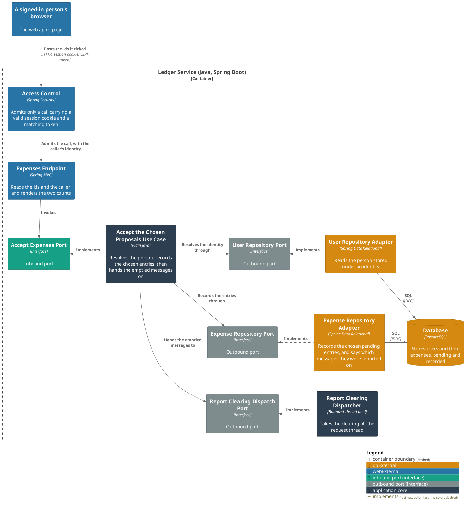
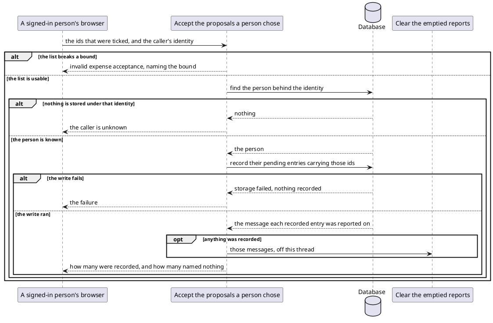

# Accept the proposals a person chose

- **In**
  - the identity of the authenticated caller
  - the [ids of the pending entries](../domain/proposal-ids.md) to accept
- **Out**
  - how many pending entries became recorded
  - how many of the ids named nothing
- **Why:** a person turns spending into their ledger from the page they read it on, one entry or a day at a time

*Implemented by `AcceptExpensesUseCase`.*

## Prerequisites

- The caller is authenticated. The request never names whose ledger it is.
- A user is stored under that identity.

What bounds the list, what an id is taken as, and how the two counts relate are all fixed by
[the specification](../../../openapi/ledger-api.yaml).

## Collaborators

| Direction | Collaborator                                                                         | Through                                                                           | For                                                                                 |
|-----------|--------------------------------------------------------------------------------------|-----------------------------------------------------------------------------------|-------------------------------------------------------------------------------------|
| in        | [Accept pending expenses](../../../web-app/docs/usecases/accept-pending-expenses.md) | [Browsing the ledger from a browser](../contracts/in/web-browse-api.md)           | turning the entries a person ticked into their ledger                               |
| out       | [Database](../contracts/out/database.md)                                             | [Users, categories and expenses](../contracts/out/database.md)                    | resolving the identity, and recording the pending entries the ids name              |
| out       | [Clear the emptied reports](clear-emptied-reports.md)                                | [Clear the emptied reports](clear-emptied-reports.md)                             | handing over the messages this acceptance may have emptied                          |

## Outcomes

| Outcome           | When                                                               | Result                                                                                       |
|-------------------|--------------------------------------------------------------------|----------------------------------------------------------------------------------------------|
| Spending accepted | the ids name pending entries of the caller's                       | those become recorded, both counts are answered, and the emptied messages go to the clearing |
| Nothing matched   | no id names a pending entry of theirs                              | both counts are answered, and no clearing is handed over                                     |
| List rejected     | the list breaks a bound [proposal ids](../domain/proposal-ids.md) sets | invalid expense acceptance, naming the bound — nothing is recorded                       |
| Body rejected     | the body is not JSON                                               | the request is refused, naming the field — nothing is recorded                             |
| Request rejected  | the request names no ids                                           | the request is refused — nothing is looked up                                              |
| Identity unknown  | nothing is stored under the caller's identity                      | the request is rejected, and nothing is recorded or handed over                              |
| Storage failed    | the write fails                                                    | the failure reaches the caller, and nothing is recorded or handed over                       |

## Components

## Flow

## References

- [ADR 0018: A proposal is a status on the expense table](../adr/0018-a-proposal-is-a-status-on-the-expense-table.md) —
  why an acceptance and a Telegram tap over the same entries record them once, and why an id survives
