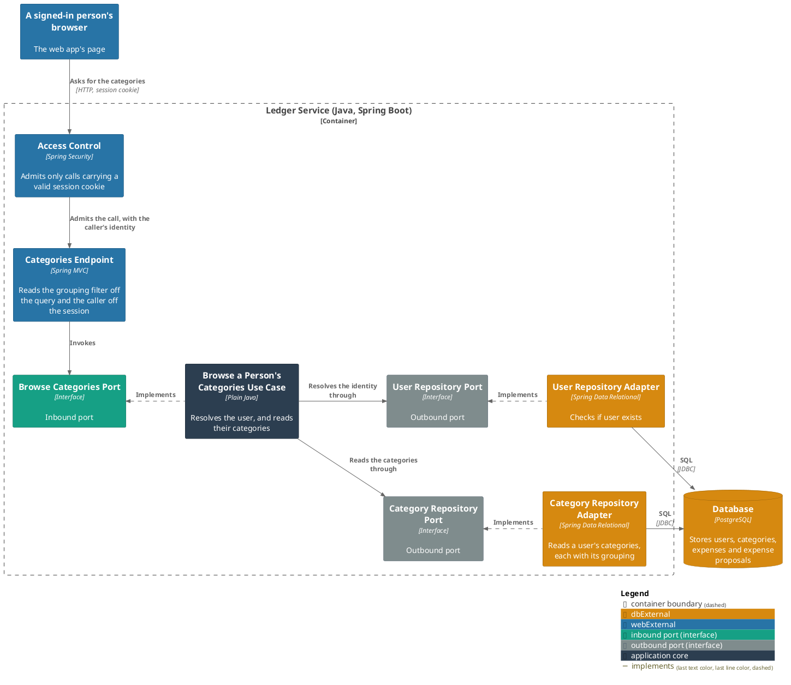
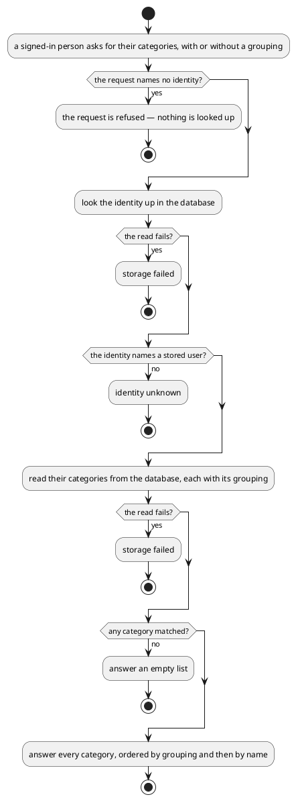

# Browse a person's categories

- **In**
  - the identity of the authenticated caller
  - a grouping, by id (optional)
- **Out**
  - their categories, whole and unpaged, ordered by grouping name then by their own
  - each carrying its own id and name, and its grouping's
- **Why:** it is what lets a browser put a name to the category an expense is filed under, and offer the
  categories a filter may choose between

*Implemented by `BrowseCategoriesUseCase`.*

## Prerequisites

- The caller is authenticated. The request never names whose categories they are.
- A user is stored under that identity.

## Collaborators

| Direction | Collaborator                                                                           | Through                                                                           | For                                                                       |
|-----------|----------------------------------------------------------------------------------------|-----------------------------------------------------------------------------------|---------------------------------------------------------------------------|
| in        | [Browse recorded expenses](../../../web-app/docs/usecases/browse-recorded-expenses.md) | [Browsing the ledger from a browser](../contracts/in/web-browse-api.md)           | naming the category on each listed expense, and filling the filter        |
| out       | [Database](../contracts/out/database.md)                                               | [Users, categories, expenses and expense proposals](../contracts/out/database.md) | resolving the identity, and reading their categories with their groupings |

A [grouping](../domain/grouping.md) is named here by its stored id. [The MCP listing](list-categories.md) takes a
name instead, and the two are not interchangeable. A grouping is never answered as a category of itself.

## Outcomes

| Outcome           | When                                                                 | Result                                        |
|-------------------|----------------------------------------------------------------------|-----------------------------------------------|
| Categories listed | the identity names a stored user                                     | every category matching the grouping filter   |
| Empty list        | the grouping names none of theirs, or they have no categories at all | no rows, and no failure                       |
| Request rejected  | the request names no identity                                        | the request is refused — nothing is looked up |
| Identity unknown  | nothing is stored under the identity                                 | the request is rejected and nothing is listed |
| Storage failed    | the store cannot be reached                                          | the failure reaches the caller                |

## Components

## Flow

