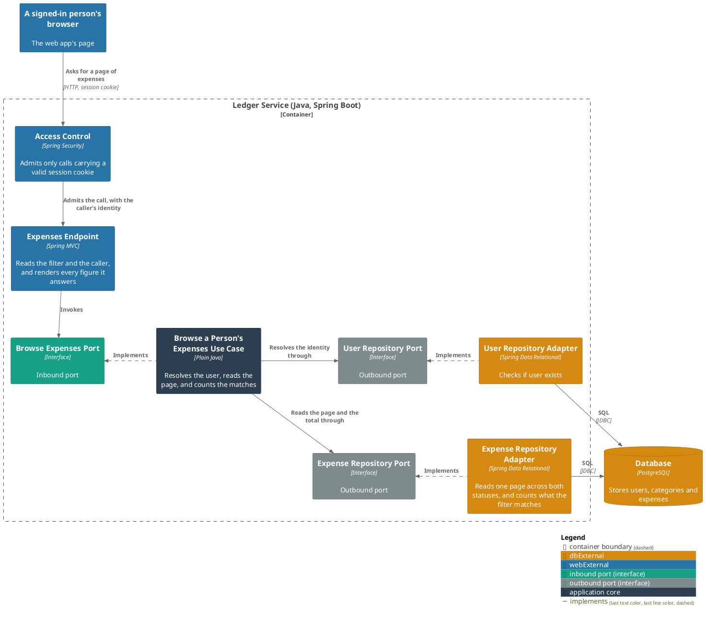
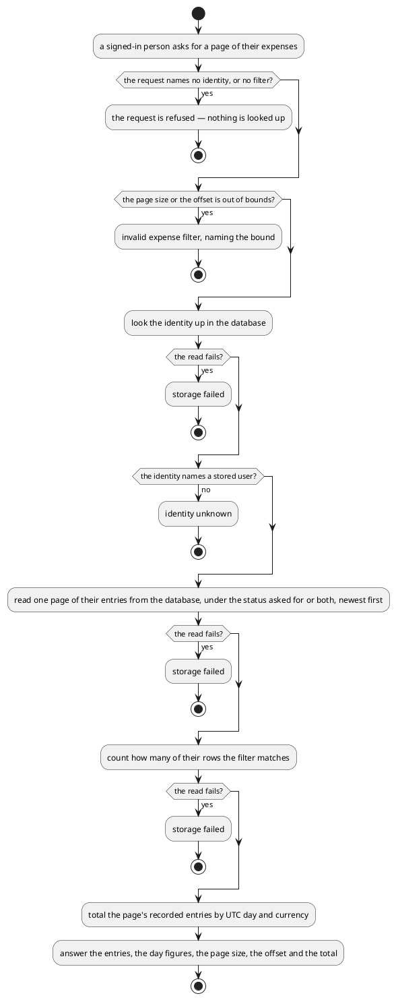

# Browse a person's expenses

- **In**
  - the identity of the authenticated caller
  - an [expense filter](../domain/expense-filter.md)
- **Out**
  - one page of entries, newest first, with the page size and the offset applied
  - how many rows the filter matches
  - each UTC day's recorded spend, as figures ready to show
- **Why:** it is how a signed-in person sees everything the ledger holds for them in one list

*Implemented by `BrowseExpensesUseCase`.*

## Prerequisites

- The caller is authenticated. The request never names whose expenses it is.
- A user is stored under that identity.

## Collaborators

| Direction | Collaborator                                                                           | Through                                                                           | For                                                                            |
|-----------|----------------------------------------------------------------------------------------|-----------------------------------------------------------------------------------|--------------------------------------------------------------------------------|
| in        | [Browse recorded expenses](../../../web-app/docs/usecases/browse-recorded-expenses.md) | [Browsing the ledger from a browser](../contracts/in/web-browse-api.md)           | showing a signed-in person their spending, newest first                        |
| out       | [Database](../contracts/out/database.md)                                               | [Users, categories and expenses](../contracts/out/database.md)                    | resolving the identity, reading the page, and counting what the filter matches |

## Outcomes

| Outcome          | When                                                           | Result                                                                                    |
|------------------|----------------------------------------------------------------|-------------------------------------------------------------------------------------------|
| Page answered    | the identity names a stored user                               | the matching entries and each day's figures, with the page size, the offset and the total |
| Empty page       | the filter matches nothing, or the offset is past the last row | no entries, no day figures, and the real total                                            |
| Request rejected | the request names no identity, or no filter                    | the request is refused — nothing is looked up                                             |
| Filter rejected  | the page size is out of bounds, or the offset is negative      | invalid expense filter, naming the bound — nothing is looked up                           |
| Identity unknown | nothing is stored under the identity                           | the request is rejected and nothing is listed                                             |
| Storage failed   | the store cannot be reached                                    | the failure reaches the caller                                                            |

An unfiltered listing answers both kinds. A category arrives as an id, named by
[the category listing](browse-categories.md).

| Kind     | Counts towards the day's figures |
|----------|----------------------------------|
| Recorded | yes                              |
| Pending  | no                               |

What the [specification](../../../openapi/ledger-api.yaml) does not fix about those figures:

- A day split by the page boundary is figured on each page, over its own part.
- A narrowed filter narrows the figures.

## Components

## Flow

