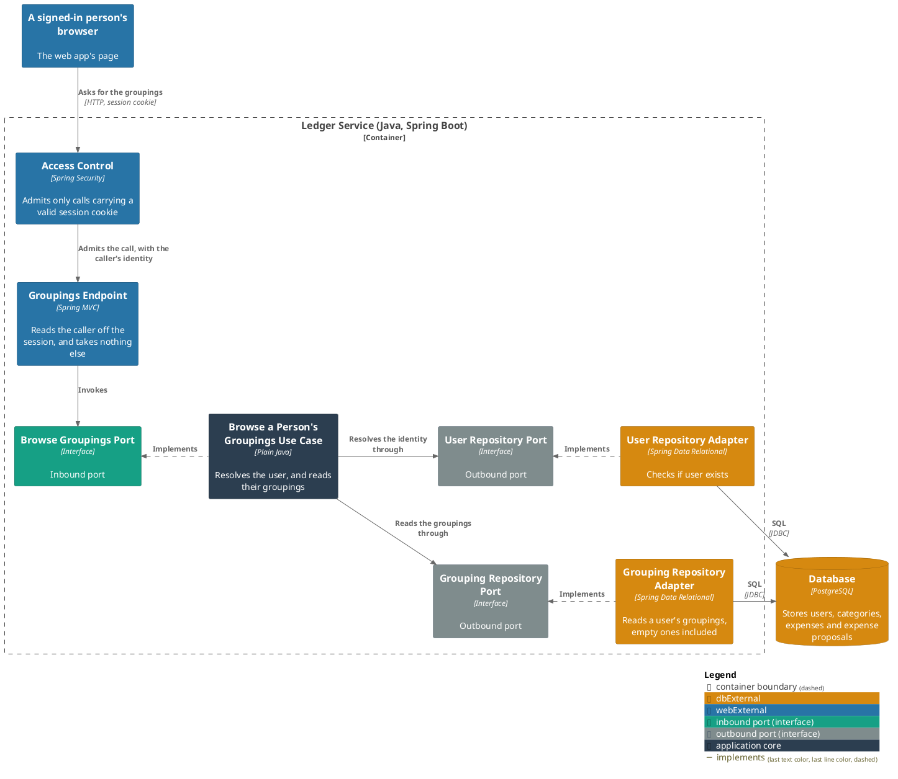
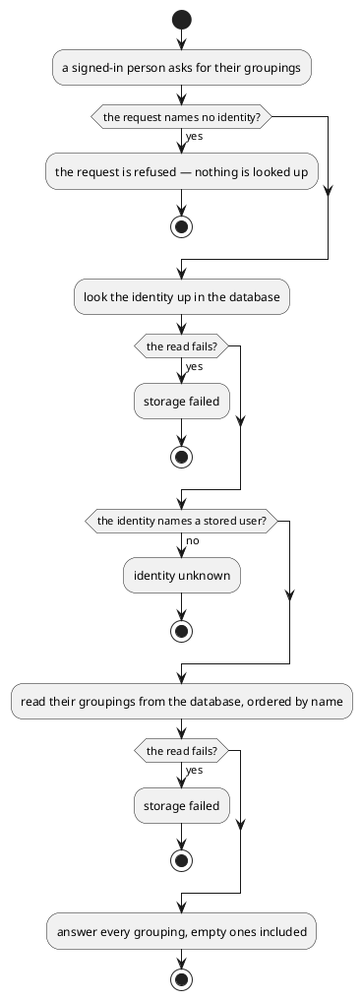

# Browse a person's groupings

- **In**
  - the identity of the authenticated caller
- **Out**
  - their groupings, whole and unpaged, ordered by name
  - each by id and name
- **Why:** it is the top of the tree a browser offers as a filter, and the source of the id
  [the category listing](browse-categories.md) narrows by

*Implemented by `BrowseGroupingsUseCase`.*

## Prerequisites

- The caller is authenticated. The request never names whose groupings they are.
- A user is stored under that identity.

## Collaborators

| Direction | Collaborator                                                                           | Through                                                                           | For                                                          |
|-----------|----------------------------------------------------------------------------------------|-----------------------------------------------------------------------------------|--------------------------------------------------------------|
| in        | [Browse recorded expenses](../../../web-app/docs/usecases/browse-recorded-expenses.md) | [Browsing the ledger from a browser](../contracts/in/web-browse-api.md)           | offering the person's groupings as a way to narrow the tree  |
| out       | [Database](../contracts/out/database.md)                                               | [Users, categories, expenses and expense proposals](../contracts/out/database.md) | resolving the identity, and reading their groupings          |

A [grouping](../domain/grouping.md) holding no categories is answered too.
[The turn answering a message](handle-incoming-message.md) hides one; this listing does not.

## Outcomes

| Outcome          | When                                 | Result                                        |
|------------------|--------------------------------------|-----------------------------------------------|
| Groupings listed | the identity names a stored user     | every grouping of theirs, ordered by name     |
| Empty list       | they have no groupings at all        | no rows, and no failure                       |
| Request rejected | the request names no identity        | the request is refused — nothing is looked up |
| Identity unknown | nothing is stored under the identity | the request is rejected and nothing is listed |
| Storage failed   | the store cannot be reached          | the failure reaches the caller                |

## Components

## Flow

