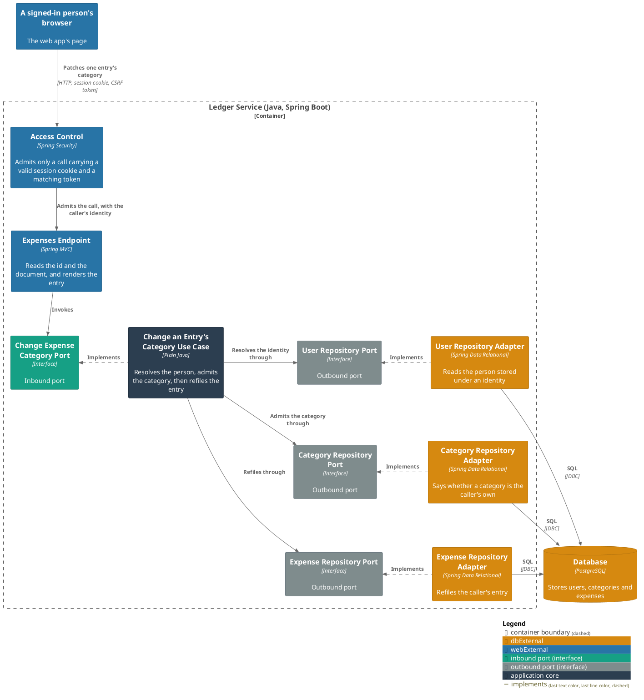
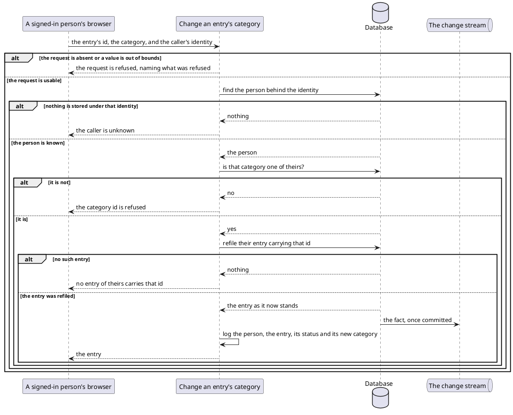

# Change an entry's category

- **In**
  - the identity of the authenticated caller
  - the entry's id
  - the category to file it under, by its stored id
- **Out**
  - the entry as it now stands
- **Why:** correcting where one piece of spending was filed, without waiting for a decision on it first

*Implemented by `ChangeExpenseCategoryUseCase`.*

## Prerequisites

- The caller is authenticated. The request never names whose ledger it is.
- A user is stored under that identity.

The path, the document and each refusal are fixed by [the specification](../../../openapi/ledger-api.yaml).

## Collaborators

| Direction | Collaborator                                                            | Through                                                                 | For                                                                    |
|-----------|-------------------------------------------------------------------------|-------------------------------------------------------------------------|------------------------------------------------------------------------|
| in        | [A signed-in person's browser](../contracts/in/web-browse-api.md)       | [Browsing the ledger from a browser](../contracts/in/web-browse-api.md) | refiling one entry under another category                              |
| out       | [Database](../contracts/out/database.md)                                | [Users, categories and expenses](../contracts/out/database.md)          | resolving the identity, admitting the category, and refiling the entry |
| out       | [A consumer of the ledger's changes](../contracts/out/change-stream.md) | [The change stream](../contracts/out/change-stream.md)                  | publishing the fact this refile produces                               |

## Outcomes

| Outcome           | When                                                      | Result                                                                    |
|-------------------|-------------------------------------------------------------|------------------------------------------------------------------------------|
| Entry refiled     | the id names an entry of theirs, and the category is theirs | its category changes, and the change is logged                           |
| Same category     | the category named is the one the entry already carries     | answered the same way; only the last-updated instant moves               |
| Entry not found   | no entry of theirs carries that id                           | the request is refused, naming the entry — nothing is refiled            |
| Category refused  | the category id names no category of theirs                 | the request is refused, naming the category id — the entry is never read |
| Request rejected  | the request is absent                                        | the request is refused — nothing is looked up                            |
| Identity unknown  | nothing is stored under the caller's identity                | the request is rejected and nothing is refiled                           |
| Storage failed    | admitting the category, or the refile itself, fails          | the failure reaches the caller, and nothing is refiled                   |

## Components

## Flow

## References

- [Browse a person's expenses](browse-expenses.md) — where the id this takes is answered
- [Browse a person's categories](browse-categories.md) — where the category id this takes is answered
- [ADR 0003: A category is unique per user and parent, not per user](../adr/0003-a-category-is-unique-per-user-and-parent-not-per-user.md) —
  why the caller sends a stored id rather than a category's name
- [ADR 0018: A proposal is a status on the expense table](../adr/0018-a-proposal-is-a-status-on-the-expense-table.md) —
  why one id is enough to name the entry, whichever status it stands under
