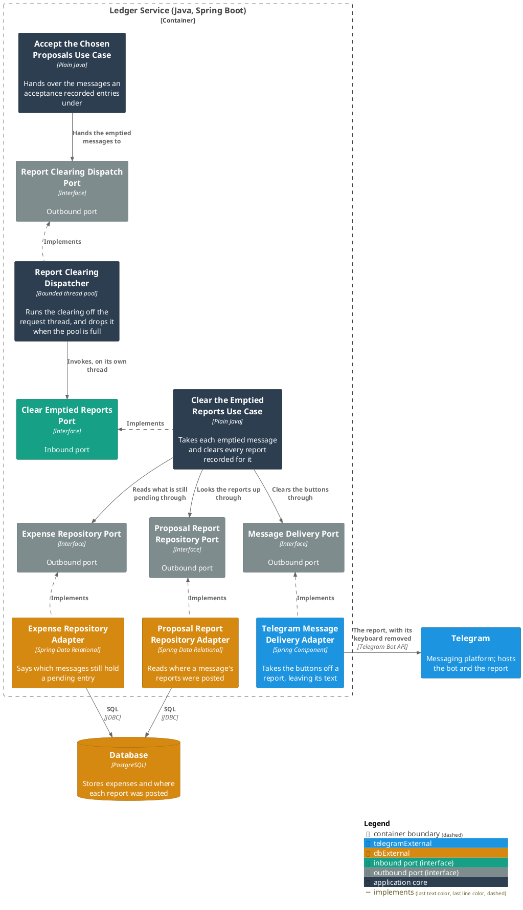
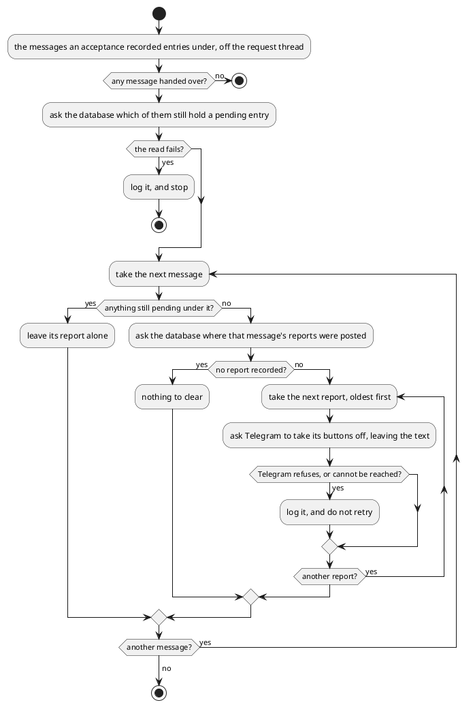

# Clear the emptied reports

- **In**
  - the person, by the id the ledger stores them under
  - the [messages](../domain/incoming-message-id.md) an acceptance recorded entries under
- **Out**
  - reports in the chat with their buttons taken off
- **Why:** a report whose spending is already accepted stops offering two buttons that decide nothing

*Implemented by `ClearEmptiedReportsUseCase`.*

## Prerequisites

- An acceptance already committed, and the person was already answered.
- The person's id is the stored one, resolved by whoever hands the work over.

## How it is entered

- It runs on a thread of its own, out of a pool whose bounds are [configuration](../configuration.md).
- Nobody waits for it. Nothing it does or fails to do reaches the browser, and nothing is retried.

## Collaborators

| Direction | Collaborator                                                      | Through                                                                           | For                                                                                 |
|-----------|-------------------------------------------------------------------|-----------------------------------------------------------------------------------|-------------------------------------------------------------------------------------|
| in        | [Accept the proposals a person chose](accept-chosen-proposals.md) | [Accept the proposals a person chose](accept-chosen-proposals.md)                 | handing over the messages an acceptance may have emptied                            |
| out       | [Database](../contracts/out/database.md)                          | [Users, categories and expenses](../contracts/out/database.md)                    | reading what is still pending under each message, and where its reports were posted |
| out       | [Telegram](../contracts/out/telegram-replies.md)                  | [Outgoing replies](../contracts/out/telegram-replies.md)                          | taking the buttons off a report the acceptance emptied                              |

## Outcomes

| Outcome             | When                                                                                 | Result                                                             |
|---------------------|--------------------------------------------------------------------------------------|--------------------------------------------------------------------|
| Report cleared      | nothing of theirs is left pending under the message, and a report is recorded for it | every report recorded for that message loses its buttons           |
| Message left alone  | one of their entries is still pending under the message                              | nothing is sent for it, and the remaining messages are still taken |
| No report recorded  | nothing says where that message's report was posted                                  | nothing is sent, and the remaining messages are still taken        |
| Clearing refused    | Telegram refuses the edit, or cannot be reached                                      | it is logged, never retried, and the next report is still taken    |
| Counts unreadable   | reading what is still pending fails                                                  | it is logged, and no report is cleared                             |
| Reports unreadable  | reading where a message's reports were posted fails                                  | the run ends there, and the messages after it are left alone       |
| Nothing handed over | the work names no message                                                            | nothing is read and nothing is sent                                |
| Clearing dropped    | the pool has no room for the work                                                    | it never runs, and nothing is queued or run on the request thread  |

## Components

## Flow

## References

- [Resolve a reported proposal](resolve-a-reported-proposal.md) — what a report that keeps its buttons answers
  when it is tapped
- [Configuration](../configuration.md) — the pool's bounds, and what happens to work it has no room for
