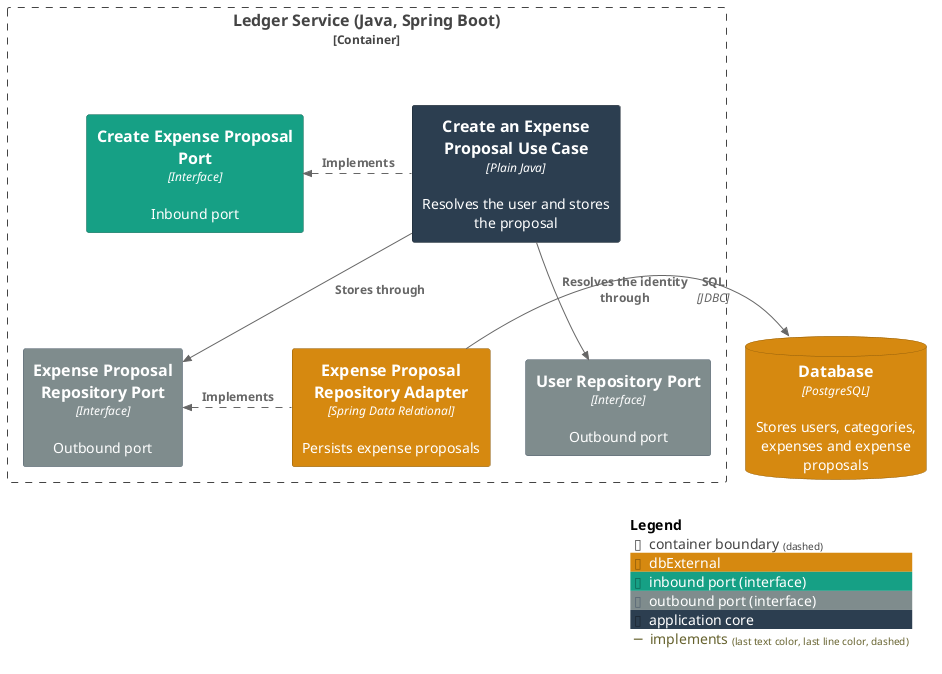
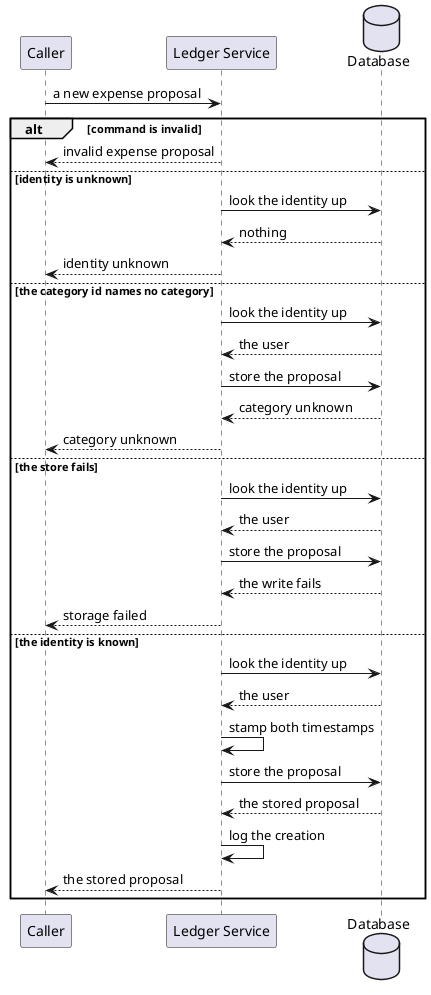

# Create an expense proposal

- **In:** the identity of the user it is recorded against · a category, by its stored id · a description ·
  a merchant (optional) · a money amount
- **Out:** the stored expense proposal
- **Why:** spending that has been assembled but not yet accepted is kept apart from the user's own ledger
  ([ADR 0006](../adr/0006-an-expense-proposal-is-a-table-and-an-entity-of-its-own.md))

*Implemented by `CreateExpenseProposalUseCase`.*

Nothing calls this use case yet.

## Collaborators

| Direction | Collaborator | Through                                                                              | For                                                             |
|-----------|--------------|--------------------------------------------------------------------------------------|-----------------------------------------------------------------|
| out       | Database     | [Users, categories, expenses and expense proposals](../contracts/out/database.md)     | resolving the user's identity, and storing the proposal          |

## Rules

- The identity is opaque text, whatever the caller identifies a person by, present and not blank.
- A description is present, and it is not blank.
- A category is named by its stored id, never by name, and the id is positive.
- A merchant is present as an optional value, never absent — but a present, blank merchant is normalized to
  absent rather than rejected.
- A money amount is present.
- Nothing is stored, and no proposal is built, when the identity names no user.
- Both timestamps are stamped at creation, equal to each other.
- How long its text may be is checked where it is stored
  ([ADR 0004](../adr/0004-column-widths-are-checked-in-the-persistence-adapter.md)).
- A stored proposal is not an expense, and nothing further happens to it yet.

## Outcomes

| Outcome           | When                                                                                                     | Result                                                                              |
|-------------------|----------------------------------------------------------------------------------------------------------|-------------------------------------------------------------------------------------|
| Proposal created  | the identity names a stored user, and every field is valid                                               | the proposal is stored, stamped with the current instant, and the creation is logged |
| Request rejected  | the command is absent, or a field violates [expense proposal](../domain/expense-proposal.md)'s invariants | invalid expense proposal — nothing is looked up or written                           |
| Identity unknown  | nothing is stored under the identity                                                                     | the request is rejected and nothing is written                                      |
| Category unknown  | the category id names no stored category                                                                 | the request is rejected and nothing is written                                      |
| Storage failed    | the store cannot be reached, or a value is too long for its column                                       | the failure reaches the caller                                                      |

## Components

## Flow

