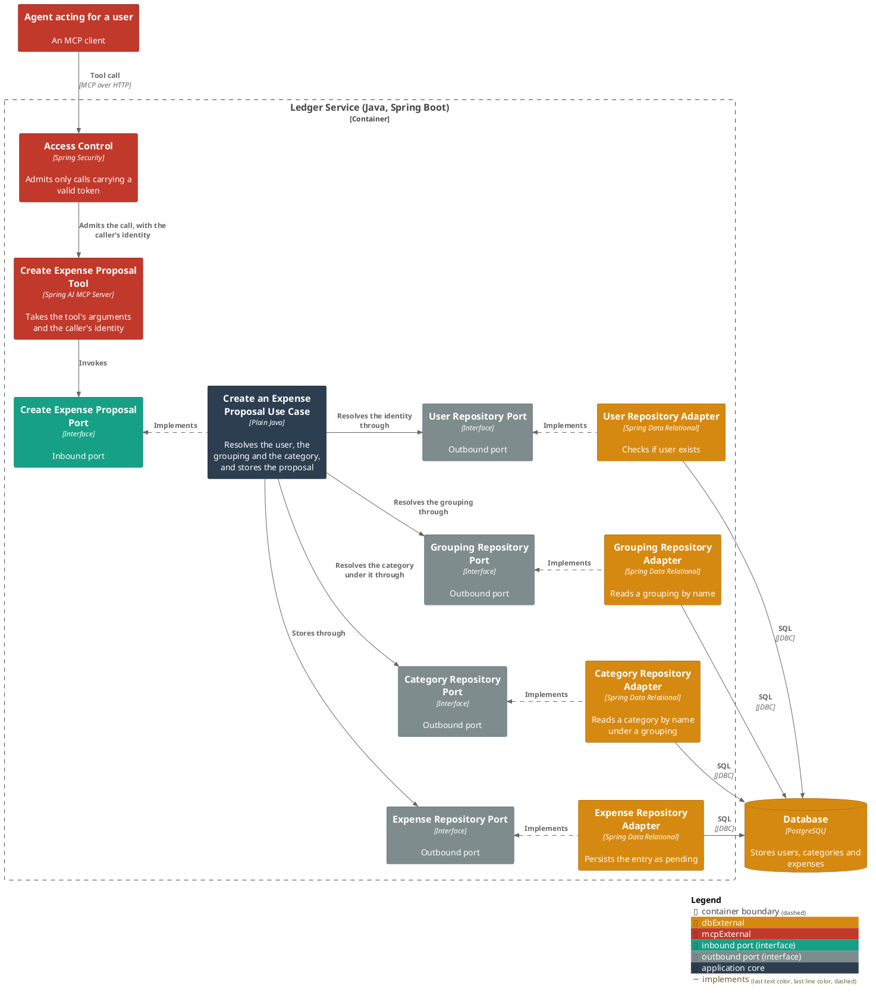
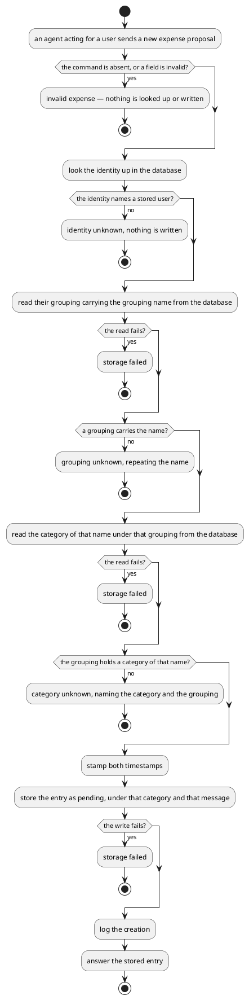

# Create an expense proposal

- **In**
  - the identity of the authenticated caller
  - the reference of the message being handled
  - a category, by name
  - the grouping that category is filed under
  - a description
  - a merchant (optional)
  - a money amount
- **Out**
  - the stored entry, pending
- **Why:** assembled spending stays out of the user's own totals until they accept it

*Implemented by `CreateExpenseProposalUseCase`.*

## Collaborators

| Direction | Collaborator                                                                                                 | Through                                                          | For                                                                          |
|-----------|--------------------------------------------------------------------------------------------------------------|------------------------------------------------------------------|--------------------------------------------------------------------------------|
| in        | [Record the spending a user's message names](../../../ai-connector-service/docs/usecases/extract-intents.md) | [MCP — the create expense proposal tool](../contracts/in/mcp.md) | recording spending assembled from a conversation                             |
| out       | [Database](../contracts/out/database.md)                                                                     | [Users, categories and expenses](../contracts/out/database.md)   | resolving the identity, the grouping and its category, and storing the entry |

## Outcomes

| Outcome          | When                                                                                    | Result                                                                                  |
|------------------|-----------------------------------------------------------------------------------------|-----------------------------------------------------------------------------------------|
| Proposal created | the identity, the grouping and a category of that name under it all resolve             | a pending entry is stored, stamped with the current instant, and the creation is logged |
| Request rejected | the command is absent, or a field violates [expense](../domain/expense.md)'s invariants | invalid expense — nothing is looked up or written                                       |
| Identity unknown | nothing is stored under the identity                                                    | the request is rejected and nothing is written                                          |
| Grouping unknown | no grouping of theirs carries the grouping name                                         | the request is rejected, repeating that name, and nothing is written                    |
| Category unknown | that grouping holds no category of the category name                                    | the request is rejected, naming both, and nothing is written                            |
| Storage failed   | the store cannot be reached, or a value is too long for its column                      | the failure reaches the caller                                                          |

## Components

## Flow

## References

- [ADR 0018: A proposal is a status on the expense table](../adr/0018-a-proposal-is-a-status-on-the-expense-table.md) —
  why the id this answers with survives the person's acceptance
- [ADR 0007: An MCP caller is identified by a signed token, not a tool argument](../adr/0007-an-mcp-caller-is-identified-by-a-signed-token-not-a-tool-argument.md) —
  why the request names no person
- [ADR 0015: A turn is named by the message that started it](../adr/0015-a-turn-is-named-by-the-message-that-started-it-not-by-a-value-minted-beside-it.md) —
  why the request names no message either
- [ADR 0003: A category is unique per user and parent, not per user](../adr/0003-a-category-is-unique-per-user-and-parent-not-per-user.md) —
  why a grouping is resolved before the category under it
- [ADR 0011: The amount is scaled to minor units in the domain](../adr/0011-the-amount-is-scaled-to-minor-units-in-the-domain.md) —
  what happens to the amount as the message wrote it
- [ADR 0004: Column widths are checked in the persistence adapter](../adr/0004-column-widths-are-checked-in-the-persistence-adapter.md) —
  where a description too long is refused
