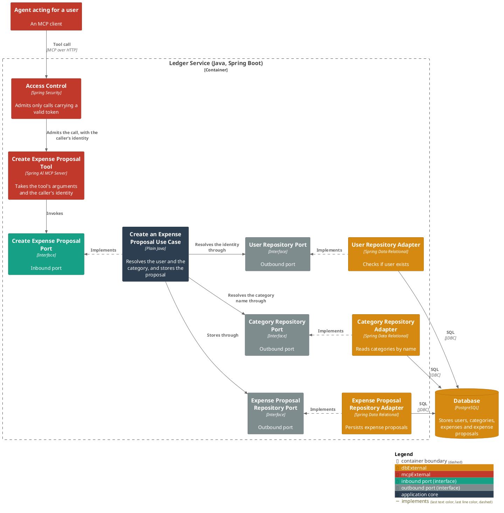
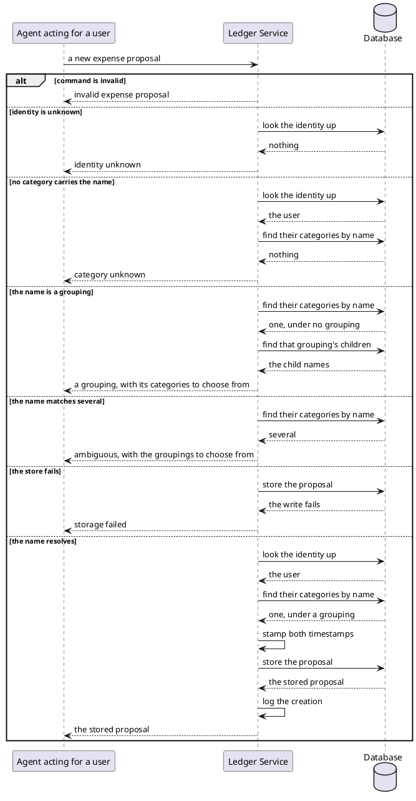

# Create an expense proposal

- **In:** the identity of the authenticated caller · the reference of the message being handled · a category, by
  name · the grouping that category sits under (optional) · a description · a merchant (optional) · a money
  amount
- **Out:** the stored expense proposal
- **Why:** spending that has been assembled but not yet accepted is kept apart from the user's own ledger
  ([ADR 0006](../adr/0006-an-expense-proposal-is-a-table-and-an-entity-of-its-own.md))

*Implemented by `CreateExpenseProposalUseCase`.*

## Collaborators

| Direction | Collaborator                                         | Through                                                                           | For                                                                       |
|-----------|------------------------------------------------------|-----------------------------------------------------------------------------------|---------------------------------------------------------------------------|
| in        | [An agent acting for a user](../contracts/in/mcp.md) | [MCP — the create expense proposal tool](../contracts/in/mcp.md)                  | recording spending it has assembled from a conversation                   |
| out       | [Database](../contracts/out/database.md)             | [Users, categories, expenses and expense proposals](../contracts/out/database.md) | resolving the identity, resolving the category name, storing the proposal |

## Rules

- The identity is the one the service has already authenticated
  ([authenticated user id](../domain/authenticated-user-id.md)); the request never names whose proposal it is
  ([ADR 0007](../adr/0007-an-mcp-caller-is-identified-by-a-signed-token-not-a-tool-argument.md)).
- The [message reference](../domain/message-reference.md) is read from the same credential as the identity, and
  the request never names it either
  ([ADR 0010](../adr/0010-a-message-reference-rides-the-caller-token-not-the-extraction-request.md)).
- A stored proposal records which message produced it, so the report answering that message can name it.
- A category is named, never identified by a stored id.
- A name is resolved among the caller's own categories only.
- Spending is filed under a category that sits under a grouping; the first level only groups.
- A name no category of theirs carries is rejected, and the message repeats the name.
- A name matching a grouping is rejected, and the message names that grouping's children to retry with.
- A name matching several of their categories is rejected, and the message names those categories' groupings to
  retry with.
- A grouping given alongside the name narrows the match, and a name that sits under no such grouping is rejected.
- A description is present, and it is not blank.
- A merchant is present as an optional value, never absent — but a present, blank merchant is normalized to
  absent rather than rejected.
- A money amount is present.
- Nothing is stored, and no proposal is built, when the identity names no user.
- Both timestamps are stamped at creation, equal to each other.
- How long its text may be is checked where it is stored
  ([ADR 0004](../adr/0004-column-widths-are-checked-in-the-persistence-adapter.md)).
- A stored proposal is not an expense, and nothing further happens to it yet.
- Nothing makes a repeat of the same request the same proposal: it stores a second one.

## Outcomes

| Outcome                | When                                                                                                      | Result                                                                               |
|------------------------|-----------------------------------------------------------------------------------------------------------|--------------------------------------------------------------------------------------|
| Proposal created       | the identity names a stored user, the name resolves to exactly one of their categories under a grouping   | the proposal is stored, stamped with the current instant, and the creation is logged |
| Request rejected       | the command is absent, or a field violates [expense proposal](../domain/expense-proposal.md)'s invariants | invalid expense proposal — nothing is looked up or written                           |
| Identity unknown       | nothing is stored under the identity                                                                      | the request is rejected and nothing is written                                       |
| Category unknown       | no category of theirs carries that name, or none of them sits under the grouping given                    | the request is rejected, naming what was asked for, and nothing is written           |
| Category is a grouping | the name resolves to a first-level grouping                                                               | the request is rejected, naming that grouping's children, and nothing is written     |
| Category ambiguous     | the name resolves to several of their categories                                                          | the request is rejected, naming the groupings to choose from, and nothing is written |
| Storage failed         | the store cannot be reached, or a value is too long for its column                                        | the failure reaches the caller                                                       |

## Components

## Flow

