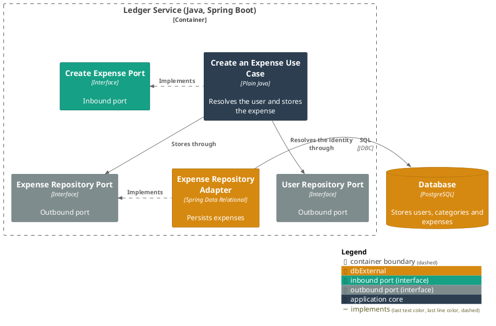
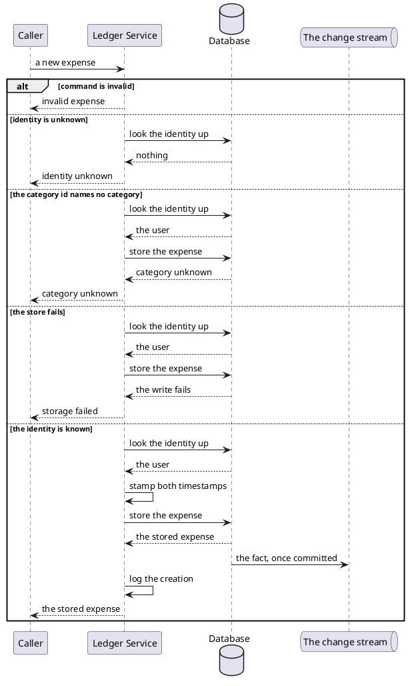

# Create an expense

- **In**
  - the identity of the user it is recorded against
  - a category, by its stored id
  - a description
  - a merchant (optional)
  - a money amount
- **Out**
  - the stored expense
- **Why:** a person's spending is kept against their own ledger, filed under a category, from the moment it
  happens

*Implemented by `CreateExpenseUseCase`.*

## Collaborators

| Direction | Collaborator                                                            | Through                                                        | For                                                    |
|-----------|-------------------------------------------------------------------------|----------------------------------------------------------------|--------------------------------------------------------|
| out       | [Database](../contracts/out/database.md)                                | [Users, categories and expenses](../contracts/out/database.md) | resolving the user's identity, and storing the expense |
| out       | [A consumer of the ledger's changes](../contracts/out/change-stream.md) | [The change stream](../contracts/out/change-stream.md)         | publishing the fact this write produced                |

## Outcomes

| Outcome          | When                                                                                       | Result                                                                              |
|------------------|--------------------------------------------------------------------------------------------|-------------------------------------------------------------------------------------|
| Expense created  | the identity names a stored user, and every field is valid                                 | the expense is stored recorded and naming no message, stamped with the current instant, and the creation is logged |
| Request rejected | the command is absent, or a field violates [expense](../domain/expense.md)'s invariants    | invalid expense — nothing is looked up or written                                   |
| Identity unknown | nothing is stored under the identity                                                       | the request is rejected and nothing is written                                      |
| Category unknown | the category id names no stored category                                                   | the request is rejected and nothing is written                                      |
| Storage failed   | the store cannot be reached, or a value is too long for its column                         | the failure reaches the caller                                                      |

## Components

## Flow

## References

- [ADR 0004: Column widths are checked in the persistence adapter](../adr/0004-column-widths-are-checked-in-the-persistence-adapter.md) —
  where a description or a merchant too long is refused
- [ADR 0003: A category is unique per user and parent, not per user](../adr/0003-a-category-is-unique-per-user-and-parent-not-per-user.md) —
  why the caller sends a stored id rather than a category's name
