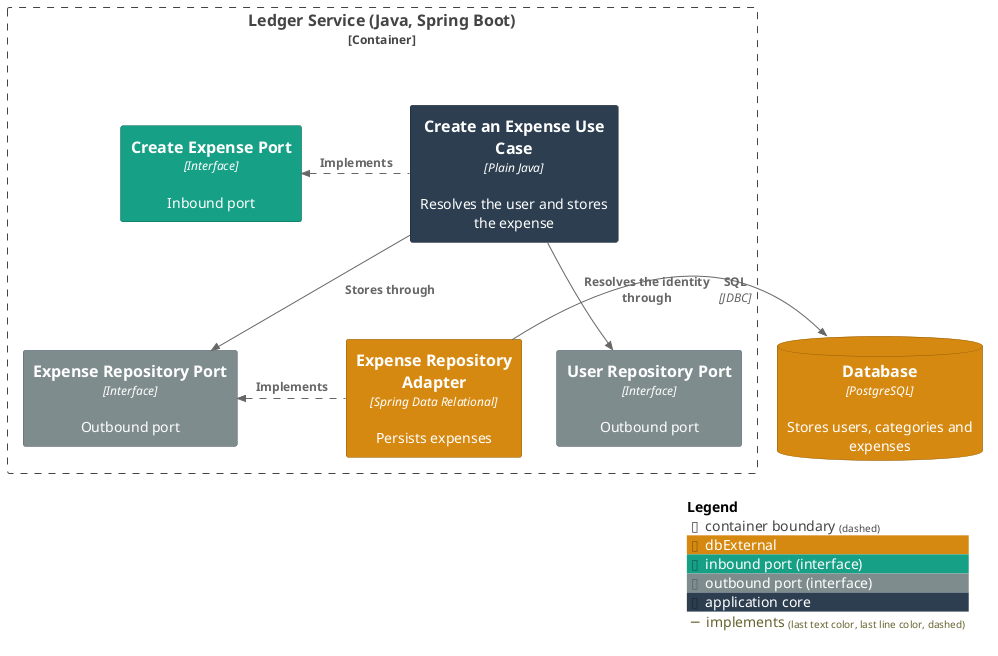
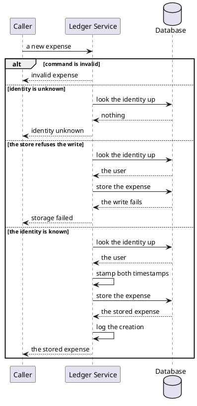

# Create an expense

- **In:** the identity of the user it is recorded against · a category, by its stored id · a description ·
  a merchant (optional) · a money amount
- **Out:** the stored expense
- **Why:** a person's spending is kept against their own ledger, filed under a category, from the moment it
  happens

*Implemented by `CreateExpenseUseCase`.*

Nothing calls this use case yet.

## Collaborators

| Direction | Collaborator | Through | For |
|-----------|--------------|---------|-----|
| out | Database | [Users, categories and expenses](../contracts/out/database.md) | resolving the user's identity, and storing the expense |

## Rules

- The identity is opaque text, whatever the caller identifies a person by.
- Nothing is stored, and no expense is built, when the identity names no user
  ([new expense](../domain/new-expense.md) invariants; [expense](../domain/expense.md) invariants).
- A category is named by its stored id, never by name — resolving a name to an id is the caller's own concern
  ([ADR 0007](../adr/0007-a-category-is-named-by-its-stored-id.md)).
- Both timestamps are stamped at creation, equal to each other.
- How long its text may be is checked where it is stored
  ([ADR 0004](../adr/0004-column-widths-are-checked-in-the-persistence-adapter.md)).

## Outcomes

| Outcome | When | Result |
|---------|------|--------|
| Expense created | the identity names a stored user, and every field is valid | the expense is stored, stamped with the current instant, and the creation is logged |
| Request rejected | the command is absent, or a field violates [new expense](../domain/new-expense.md)'s invariants | invalid expense — nothing is looked up or written |
| Identity unknown | nothing is stored under the identity | the request is rejected and nothing is written |
| Storage failed | the store cannot be reached, refuses the write, or a value is too long for its column | the failure reaches the caller |

## Components

## Flow

