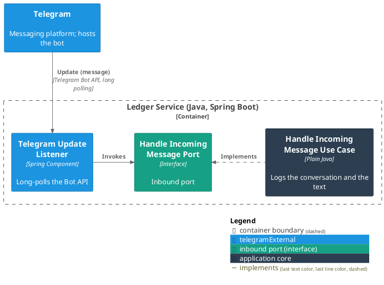
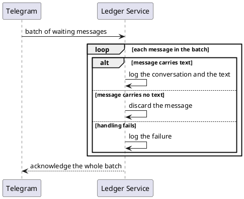

# Receive a user's message

- **In:** the conversation a message belongs to · its text
- **Out:** a log entry
- **Why:** it is the point at which a user's words enter the service; today the log is where they stop

*Implemented by `HandleIncomingMessageUseCase`.*

## Collaborators

| Direction | Collaborator                                    | Through                                                  | For                                     |
|-----------|-------------------------------------------------|----------------------------------------------------------|-----------------------------------------|
| in        | [Telegram](../contracts/in/telegram-updates.md) | [Incoming messages](../contracts/in/telegram-updates.md) | delivering what a user typed to the bot |

Nothing is called outward.

## Rules

- A message is accepted only when it names a conversation and carries text.
- The conversation is whatever Telegram identifies it by, kept as opaque text.
- The log entry is all that happens: nothing is stored, nothing is extracted, and the user gets no reply.
- A batch is acknowledged whole, so Telegram moves on to the messages behind it.

## Outcomes

| Outcome           | When                                  | Result                                                                  |
|-------------------|---------------------------------------|-------------------------------------------------------------------------|
| Message logged    | the message carries text              | the conversation and the text are written to the service's log          |
| Message discarded | the message carries no text           | nothing is logged and the message is not seen again                     |
| Handling failed   | handling the message raises a failure | the failure is logged in its place and the batch is acknowledged anyway |

## Components

## Flow

