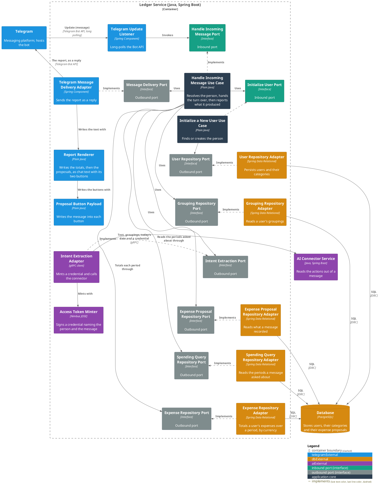
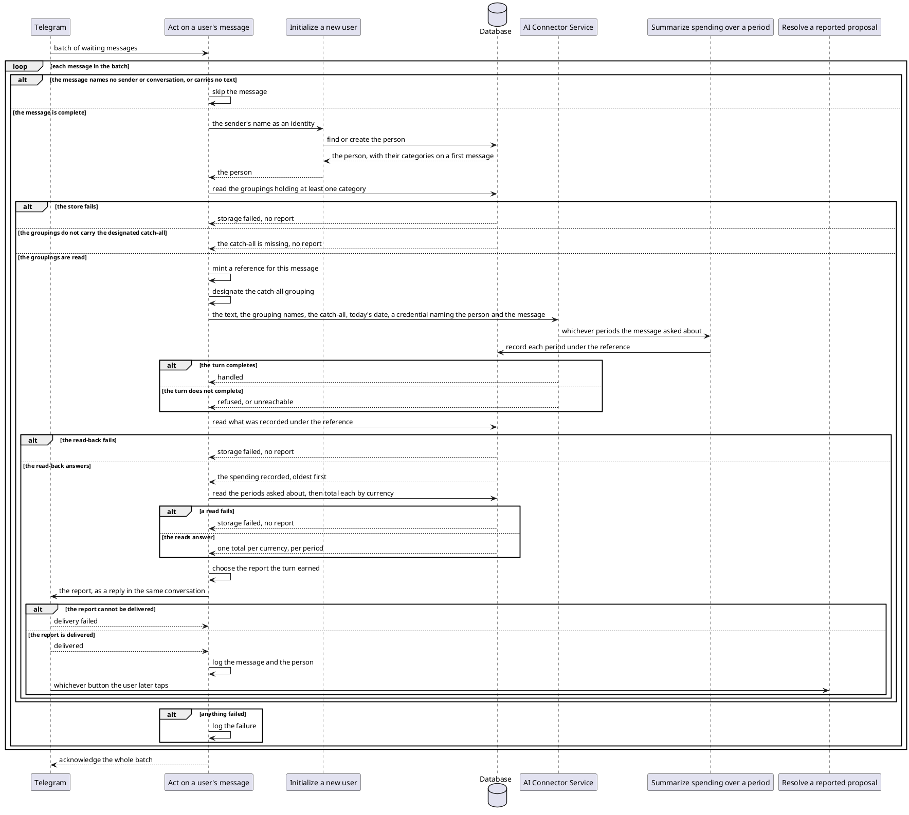

# Act on a user's message

- **In:** who sent the message · the conversation it was sent in · which message it is · its text
- **Out:** a report of what that message produced — the spending it named, and the totals it asked for — sent
  back into the conversation
- **Why:** it is the point at which a user's words become spending someone can review, and the point at which
  they find out what was made of them

*Implemented by `HandleIncomingMessageUseCase`.*

## The report

Every message that reaches the turn is answered with exactly one of these. What each one looks like in the chat
is [written out where it is rendered](../contracts/out/telegram-replies.md#what-a-user-reads).

| Report             | What it tells the user                                                                                                                                     |
|--------------------|------------------------------------------------------------------------------------------------------------------------------------------------------------|
| Recorded           | how many expenses were noted, each with its category and grouping, description, merchant when there is one, and amount — all awaiting their confirmation |
| Answered           | only what was asked about was answered — the message named no expense                                                                                    |
| Nothing identified | the message named no expense and asked nothing                                                                                                             |
| Partial            | something went wrong, so the list that follows may be incomplete — then the same list                                                                    |
| Failed             | something went wrong and nothing was noted                                                                                                                 |

Whatever the report says, it opens with a block for each [period](../domain/spending-period.md) the message
asked about: what was spent in it, one line per currency and the number of expenses behind each, or a line
saying nothing is recorded in it. Those totals are the user's own ledger, and are the only figures in the report
that are.

Nothing else in a report is worded as accepted or final: what it lists below the totals is proposals, not the
user's ledger ([ADR 0006](../adr/0006-an-expense-proposal-is-a-table-and-an-entity-of-its-own.md)).

A report that lists at least one proposal carries a **Confirm** and a **Delete** button, so what it lists can be
[resolved](resolve-a-reported-proposal.md). A report that lists none carries neither, however many totals it
opens with.

## Collaborators

| Direction | Collaborator                                                                                                 | Through                                                                           | For                                                                                                       |
|-----------|--------------------------------------------------------------------------------------------------------------|-----------------------------------------------------------------------------------|---------------------------------------------------------------------------------------------------------------|
| in        | [Telegram](../contracts/in/telegram-updates.md)                                                              | [Incoming messages](../contracts/in/telegram-updates.md)                          | delivering what a user typed to the bot                                                                   |
| out       | [Initialize a new user](initialize-a-new-user.md)                                                            | [Initialize a new user](initialize-a-new-user.md)                                 | resolving the person who sent the message, creating them on first sight                                   |
| out       | [Database](../contracts/out/database.md)                                                                     | [Users, categories, expenses and expense proposals](../contracts/out/database.md) | reading the groupings that person's categories sit under, what this message recorded, and what it spent   |
| out       | [Record the spending a user's message names](../../../ai-connector-service/docs/usecases/extract-intents.md) | [AI Connector Service — intent extraction](../contracts/out/ai-connector.md)    | acting on whatever the message asks for, as that person                                                   |
| out       | [Summarize spending over a period](summarize-spending.md)                                                    | [Users, categories, expenses and expense proposals](../contracts/out/database.md) | picking up the periods that message asked about, so each can be totalled                                  |
| out       | [Telegram](../contracts/out/telegram-replies.md)                                                             | [Outgoing replies](../contracts/out/telegram-replies.md)                          | putting the report in front of whoever sent the message                                                   |
| out       | [Resolve a reported proposal](resolve-a-reported-proposal.md)                                                | [Outgoing replies](../contracts/out/telegram-replies.md)                          | handing over what the report lists, through the buttons it carries                                        |

## Rules

- The person is the sender. The conversation is only where the answer goes, so the same person keeps one ledger
  wherever they write from, and a group chat is not one shared identity.
- A message names its sender, its conversation and itself. None of the three is blank.
- Its text is present and not blank.
- Each of those names is opaque text: whatever the delivering platform calls a sender, a conversation and a
  message. Here it is Telegram that names them.
- The sender's name is the identity the person is stored under, so a first message creates them and their
  categories, and every later one finds them.
- What travels to the connector is the names of the groupings that person's categories sit under, in
  alphabetical order. No category name travels; the connector
  [asks for a grouping's categories](list-categories.md) when it needs them.
- A grouping holding no categories does not travel: there is nothing in it to file spending under.
- One of those groupings travels designated as the catch-all, so spending that fits none of the others still has
  somewhere to go.
- The designated catch-all is the [catch-all every catalogue starts with](../domain/grouping.md), and nothing
  else. A person whose groupings do not carry that name has a catalogue that cannot exist, so the turn ends
  there rather than falling back to another grouping.
- No currency is assumed. An amount stated without one is not acted on.
- The day the turn runs on travels too, in UTC.
- So a period asked for in words — "last week", "this month" — is worked out against a day the service named,
  never one the connector guessed.
- The connector acts as that person for the length of the turn, on a credential minted per call
  ([ADR 0007](../adr/0007-an-mcp-caller-is-identified-by-a-signed-token-not-a-tool-argument.md)).
- A [message reference](../domain/message-reference.md) is minted per message and rides that credential, so
  everything the turn records carries it
  ([ADR 0010](../adr/0010-a-message-reference-rides-the-caller-token-not-the-extraction-request.md)).
- Only what was recorded under this message's reference is reported, oldest first. That covers the spending it
  named and the periods it asked about alike.
- A period asked about twice in one turn is reported once. Two different periods are two blocks, oldest first.
- A period is totalled over that person's expenses alone. A proposal awaiting confirmation counts towards
  nothing.
- An expense counts towards the period its confirmation falls in, not the day the money was spent. Nothing
  records the latter.
- Currencies are never added together and never converted. One line per currency.
- A period the ledger holds nothing in is reported as holding nothing. It is not left out, and it is not a
  failure.
- A turn the connector could not complete is still reported: what it managed to record is read back and named.
- Spending recorded after the read-back has run stays stored and appears in no report.
- Spending the model tried and failed to record is stored nowhere, so it is in no report either.
- The report goes to the conversation the message came from, as a reply to that message.
- One message is one turn: nothing is retried, and a failed turn is not replayed.
- The user's own words reach this service's log only at debug level.

## Outcomes

| Outcome           | When                                                                                      | Result                                                                                   |
|-------------------|-------------------------------------------------------------------------------------------|------------------------------------------------------------------------------------------|
| Message answered  | the person resolves and what the message produced can be read back                        | one report goes into the conversation, and an info line names the message and the person |
| Message skipped   | the message names no sender or no conversation, or carries no text                        | nothing happens and the message is not seen again                                        |
| Message rejected  | the message is absent                                                                     | invalid incoming message — nothing is looked up                                        |
| Catch-all missing | the person's groupings do not carry the designated catch-all, or they have none           | the connector is never reached, no report is sent, and the failure reaches the caller    |
| Storage failed    | the person cannot be resolved, their categories not read, or a read-back or a total fails | the failure reaches the caller and no report is sent                                     |
| Delivery failed   | the report cannot be put in front of the user                                              | the failure reaches the caller; what was recorded stays recorded                         |

A failure of any kind is logged where the message was delivered, and its batch is acknowledged with the rest. A
connector that refuses the turn or cannot be reached is not a failure here — it is what the partial and failed
reports say.

## Components

## Flow

