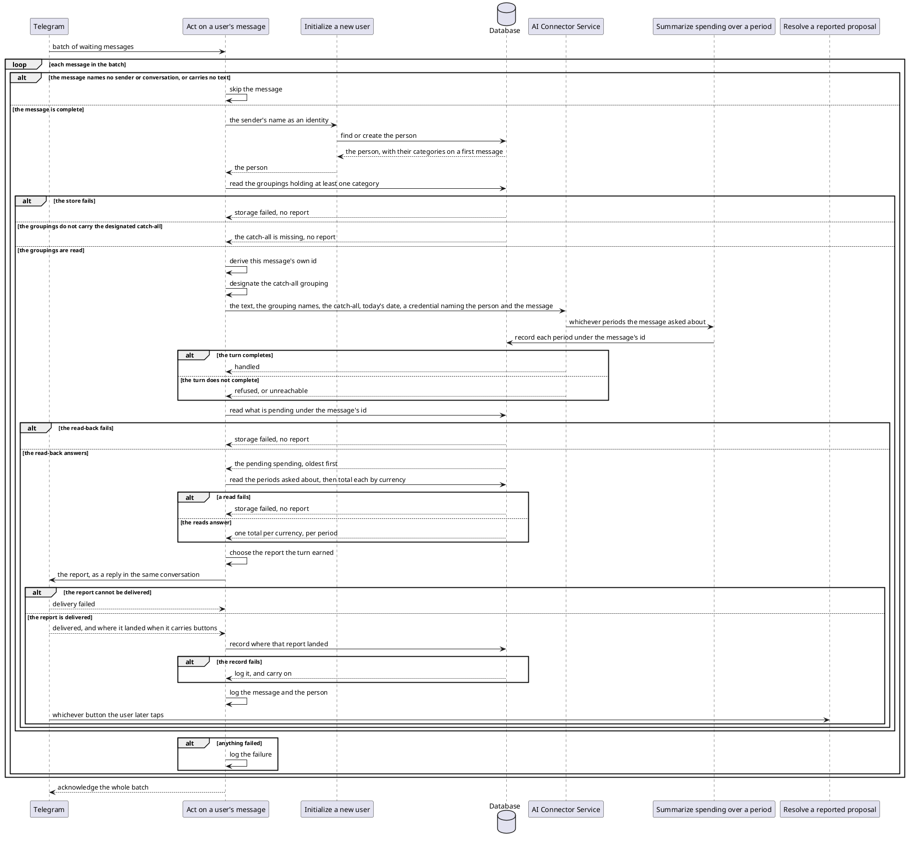

# Act on a user's message

- **In**
  - who sent the message
  - the conversation it was sent in
  - which message it is
  - its text
- **Out**
  - a report of what that message produced — the spending it named, and the totals it asked for — sent back
    into the conversation
- **Why:** a user's words become spending someone can review, and the user is told what was made of them

*Implemented by `HandleIncomingMessageUseCase`.*

## The report

Every message that reaches the turn is answered with exactly one of these. What each one looks like in the chat
is [written out where it is rendered](../contracts/out/telegram-replies.md#what-a-user-reads).

| Report             | What it tells the user                                                                                                                                     |
|--------------------|------------------------------------------------------------------------------------------------------------------------------------------------------------|
| Recorded           | how many expenses were noted, each with its category and grouping, description, merchant when there is one, and amount — all awaiting their confirmation |
| Answered           | only what was asked about was answered — the message named no expense                                                                                    |
| Nothing identified | the message named no expense and asked nothing                                                                                                             |
| Partial            | something went wrong, so the list that follows may be incomplete — then the same list                                                                    |
| Failed             | something went wrong and nothing was noted                                                                                                                 |

Whatever the report says, it opens with a block for each [period](../domain/spending-period.md) the message
asked about: what was spent in it, one line per currency and the number of expenses behind each, or a line
saying nothing is recorded in it. Those totals are the user's own ledger, and the only figures in the report that
are: what it lists below them is [pending](../domain/expense-status.md).

A report that lists at least one proposal carries a **Confirm** and a **Delete** button, so what it lists can be
[resolved](resolve-a-reported-proposal.md). A report that lists none carries neither, however many totals it
opens with.

## Collaborators

| Direction | Collaborator                                                                                                 | Through                                                                           | For                                                                                                       |
|-----------|--------------------------------------------------------------------------------------------------------------|-----------------------------------------------------------------------------------|---------------------------------------------------------------------------------------------------------------|
| in        | [Telegram](../contracts/in/telegram-updates.md)                                                              | [Incoming messages](../contracts/in/telegram-updates.md)                          | delivering what a user typed to the bot                                                                   |
| out       | [Initialize a new user](initialize-a-new-user.md)                                                            | [Initialize a new user](initialize-a-new-user.md)                                 | resolving the person who sent the message, creating them on first sight                                   |
| out       | [Database](../contracts/out/database.md)                                                                     | [Users, categories and expenses](../contracts/out/database.md)                    | reading the groupings that person's categories sit under, what this message left pending and what it spent, and recording where the report landed |
| out       | [Record the spending a user's message names](../../../ai-connector-service/docs/usecases/extract-intents.md) | [AI Connector Service — intent extraction](../contracts/out/ai-connector.md)    | acting on whatever the message asks for, as that person                                                   |
| out       | [Summarize spending over a period](summarize-spending.md)                                                    | [Users, categories and expenses](../contracts/out/database.md)                    | picking up the periods that message asked about, so each can be totalled                                  |
| out       | [Telegram](../contracts/out/telegram-replies.md)                                                             | [Outgoing replies](../contracts/out/telegram-replies.md)                          | putting the report in front of whoever sent the message                                                   |
| out       | [Resolve a reported proposal](resolve-a-reported-proposal.md)                                                | [Outgoing replies](../contracts/out/telegram-replies.md)                          | handing over what the report lists, through the buttons it carries                                        |

## Outcomes

| Outcome           | When                                                                                      | Result                                                                                   |
|-------------------|-------------------------------------------------------------------------------------------|------------------------------------------------------------------------------------------|
| Message answered  | the person resolves and what the message produced can be read back                        | one report goes into the conversation, and an info line names the message and the person |
| Message skipped   | the message names no sender or no conversation, or carries no text                        | nothing happens and the message is not seen again                                        |
| Message rejected  | the message is absent                                                                     | invalid incoming message — nothing is looked up                                        |
| Catch-all missing | the person's groupings do not carry the designated catch-all, or they have none           | the connector is never reached, no report is sent, and the failure reaches the caller    |
| Storage failed    | the person cannot be resolved, their categories not read, or a read-back or a total fails | the failure reaches the caller and no report is sent                                     |
| Delivery failed   | the report cannot be put in front of the user                                              | the failure reaches the caller; what was recorded stays recorded, and no location is kept |
| Location unkept   | the report was delivered but where it landed cannot be stored                              | the turn stands, and nothing records where the report is                                 |

A failure of any kind is [logged, and its batch acknowledged with the rest](../contracts/in/telegram-updates.md).
A connector that refuses the turn or cannot be reached is none of these outcomes: it is what the partial and
failed reports say.

Every message that reaches the turn is [counted once](../contracts/in/operations.md#meters).

## Components

```plantuml
@startuml C3-Component-ActOnUserMessage
!include <C4/C4_Component>

AddElementTag("telegramExternal", $bgColor="#1c94e0", $fontColor="#ffffff", $borderColor="#125d8c")
AddElementTag("dbExternal", $bgColor="#d68910", $fontColor="#ffffff", $borderColor="#8f5c0a")
AddElementTag("aiExternal", $bgColor="#8e44ad", $fontColor="#ffffff", $borderColor="#5b2c6f")
AddElementTag("portIn", $bgColor="#16a085", $fontColor="#ffffff", $borderColor="#0e6655", $legendText="inbound port (interface)")
AddElementTag("portOut", $bgColor="#7f8c8d", $fontColor="#ffffff", $borderColor="#566573", $legendText="outbound port (interface)")
AddElementTag("core", $bgColor="#2c3e50", $fontColor="#ffffff", $borderColor="#1b2631", $legendText="application core")
AddRelTag("implements", $lineStyle="dashed")

System_Ext(telegram, "Telegram", "Messaging platform; hosts the bot", $tags="telegramExternal")

Container_Boundary(ledger, "Ledger Service (Java, Spring Boot)") {
  Component(telegramListener, "Telegram Update Listener", "Spring Component", "Long-polls the Bot API", $tags="telegramExternal")
  Component(handleMessagePort, "Handle Incoming Message Port", "Interface", "Inbound port", $tags="portIn")
  Component(handleMessageService, "Handle Incoming Message Use Case", "Plain Java", "Resolves the person, hands the turn over, then reports what it produced", $tags="core")
  Component(initializeUserPort, "Initialize User Port", "Interface", "Inbound port", $tags="portIn")
  Component(initializeUserService, "Initialize a New User Use Case", "Plain Java", "Finds or creates the person", $tags="core")
  Component(messageDeliveryPort, "Message Delivery Port", "Interface", "Outbound port", $tags="portOut")
  Component(groupingRepositoryPort, "Grouping Repository Port", "Interface", "Outbound port", $tags="portOut")
  Component(spendingQueryRepositoryPort, "Spending Query Repository Port", "Interface", "Outbound port", $tags="portOut")
  Component(expenseRepositoryPort, "Expense Repository Port", "Interface", "Outbound port", $tags="portOut")
  Component(reportRepositoryPort, "Proposal Report Repository Port", "Interface", "Outbound port", $tags="portOut")
  Component(intentExtractionPort, "Intent Extraction Port", "Interface", "Outbound port", $tags="portOut")
  Component(deliveryAdapter, "Telegram Message Delivery Adapter", "Spring Component", "Sends the report as a reply", $tags="telegramExternal")
  Component(groupingRepositoryAdapter, "Grouping Repository Adapter", "Spring Data Relational", "Reads a user's groupings", $tags="dbExternal")
  Component(spendingQueryRepositoryAdapter, "Spending Query Repository Adapter", "Spring Data Relational", "Reads the periods a message asked about", $tags="dbExternal")
  Component(expenseRepositoryAdapter, "Expense Repository Adapter", "Spring Data Relational", "Reads what a message left pending, and totals recorded spending by currency", $tags="dbExternal")
  Component(reportRepositoryAdapter, "Proposal Report Repository Adapter", "Spring Data Relational", "Records where a delivered report landed", $tags="dbExternal")
  Component(intentExtractionAdapter, "Intent Extraction Adapter", "gRPC client", "Mints a credential and calls the connector", $tags="aiExternal")
  Component(tokenMinter, "Access Token Minter", "Nimbus JOSE", "Signs a credential naming the person and the message", $tags="aiExternal")
  Component(reportRenderer, "Report Renderer", "Plain Java", "Writes the totals, then the proposals, as chat text with its two buttons", $tags="telegramExternal")
  Component(buttonPayload, "Proposal Button Payload", "Plain Java", "Writes the message into each button", $tags="telegramExternal")
}

ContainerDb(db, "Database", "PostgreSQL", "Stores users, their categories and their expenses", $tags="dbExternal")
Container(connector, "AI Connector Service", "Java, Spring Boot", "Reads the actions out of a message", $tags="aiExternal")

Rel_R(telegram, telegramListener, "Update (message)", "Telegram Bot API, long polling")
Rel_R(telegramListener, handleMessagePort, "Invokes")
Rel_U(handleMessageService, handleMessagePort, "Implements", $tags="implements")
Rel_U(handleMessageService, initializeUserPort, "Uses")
Rel_U(initializeUserService, initializeUserPort, "Implements", $tags="implements")

Rel_L(handleMessageService, messageDeliveryPort, "Uses")
Rel_D(handleMessageService, groupingRepositoryPort, "Uses")
Rel_D(handleMessageService, spendingQueryRepositoryPort, "Reads the periods asked about through")
Rel_D(handleMessageService, expenseRepositoryPort, "Reads what is pending, and totals each period, through")
Rel_D(handleMessageService, reportRepositoryPort, "Records where the report landed through")
Rel_R(handleMessageService, intentExtractionPort, "Uses")

Rel_U(deliveryAdapter, messageDeliveryPort, "Implements", $tags="implements")
Rel_U(groupingRepositoryAdapter, groupingRepositoryPort, "Implements", $tags="implements")
Rel_U(spendingQueryRepositoryAdapter, spendingQueryRepositoryPort, "Implements", $tags="implements")
Rel_U(expenseRepositoryAdapter, expenseRepositoryPort, "Implements", $tags="implements")
Rel_U(reportRepositoryAdapter, reportRepositoryPort, "Implements", $tags="implements")
Rel_U(intentExtractionAdapter, intentExtractionPort, "Implements", $tags="implements")

Rel_D(intentExtractionAdapter, tokenMinter, "Mints with")
Rel_D(deliveryAdapter, reportRenderer, "Writes the text with")
Rel_R(reportRenderer, buttonPayload, "Writes the buttons with")

Rel_D(groupingRepositoryAdapter, db, "SQL", "JDBC")
Rel_D(spendingQueryRepositoryAdapter, db, "SQL", "JDBC")
Rel_D(expenseRepositoryAdapter, db, "SQL", "JDBC")
Rel_D(reportRepositoryAdapter, db, "SQL", "JDBC")
Rel_D(intentExtractionAdapter, connector, "Text, groupings, today's date and a credential", "gRPC")
Rel_L(deliveryAdapter, telegram, "The report, as a reply", "Telegram Bot API")

Lay_R(messageDeliveryPort, groupingRepositoryPort)
Lay_R(groupingRepositoryPort, spendingQueryRepositoryPort)
Lay_R(spendingQueryRepositoryPort, expenseRepositoryPort)
Lay_R(expenseRepositoryPort, reportRepositoryPort)
Lay_R(reportRepositoryPort, intentExtractionPort)

Lay_R(deliveryAdapter, groupingRepositoryAdapter)
Lay_R(groupingRepositoryAdapter, spendingQueryRepositoryAdapter)
Lay_R(spendingQueryRepositoryAdapter, expenseRepositoryAdapter)
Lay_R(expenseRepositoryAdapter, reportRepositoryAdapter)
Lay_R(reportRepositoryAdapter, intentExtractionAdapter)

Lay_R(reportRenderer, buttonPayload)

SHOW_LEGEND()
@enduml
```

## Flow

## References

- [ADR 0001: Telegram updates arrive by long polling](../adr/0001-telegram-updates-arrive-by-long-polling.md) —
  why the service reaches out for messages rather than being called
- [ADR 0018: A proposal is a status on the expense table](../adr/0018-a-proposal-is-a-status-on-the-expense-table.md) —
  why what the report lists is not yet in the totals it opens with
- [ADR 0007: An MCP caller is identified by a signed token, not a tool argument](../adr/0007-an-mcp-caller-is-identified-by-a-signed-token-not-a-tool-argument.md) —
  how the connector acts as the person for the length of the turn
- [ADR 0015: A turn is named by the message that started it](../adr/0015-a-turn-is-named-by-the-message-that-started-it-not-by-a-value-minted-beside-it.md) —
  why everything the turn records carries the message's own id
