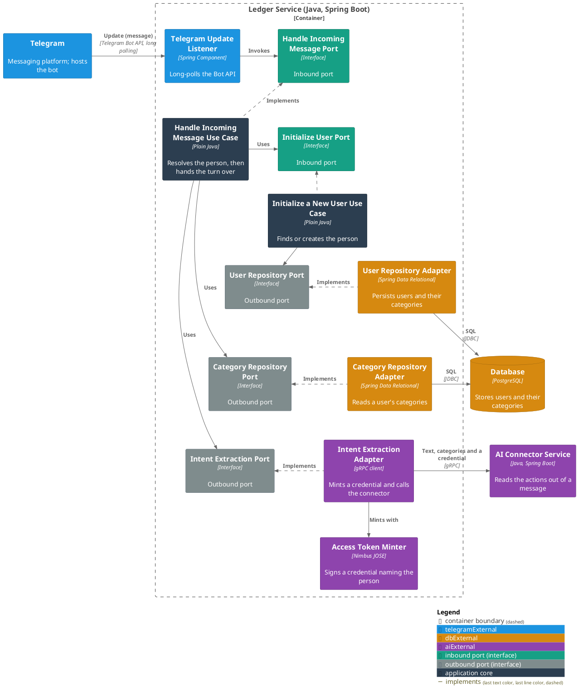
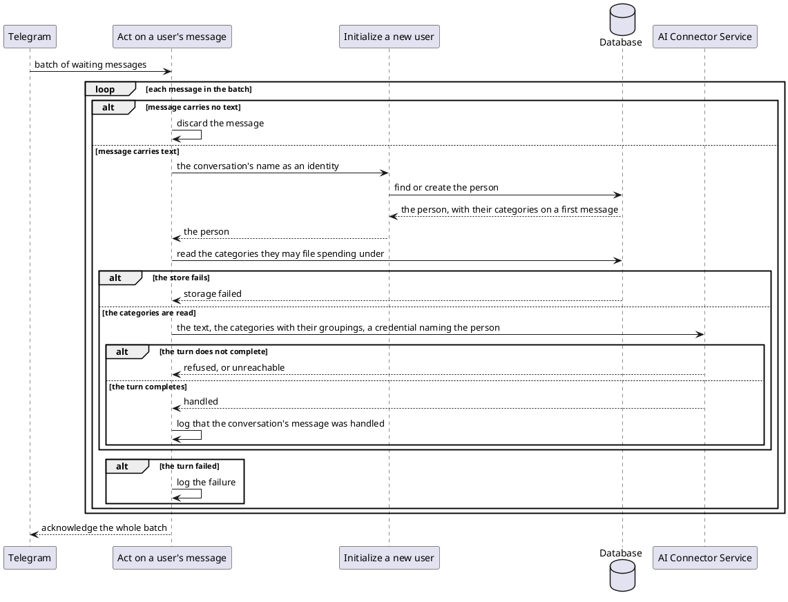

# Act on a user's message

- **In:** the conversation a message belongs to · its text
- **Out:** nothing — the turn either completes or fails
- **Why:** it is the point at which a user's words become spending someone can review

*Implemented by `HandleIncomingMessageUseCase`.*

## Collaborators

| Direction | Collaborator                                                                                                       | Through                                                                                                                   | For                                                                        |
|-----------|--------------------------------------------------------------------------------------------------------------------|-----------------------------------------------------------------------------------------------------------------------------|------------------------------------------------------------------------------|
| in        | [Telegram](../contracts/in/telegram-updates.md)                                                                    | [Incoming messages](../contracts/in/telegram-updates.md)                                                                  | delivering what a user typed to the bot                                    |
| out       | [Initialize a new user](initialize-a-new-user.md)                                                                  | [Initialize a new user](initialize-a-new-user.md)                                                                         | resolving the person behind the conversation, creating them on first sight |
| out       | [Database](../contracts/out/database.md)                                                                           | [Users, categories, expenses and expense proposals](../contracts/out/database.md)                                         | reading the categories that person may file spending under                 |
| out       | [Extract the intents in a user's message](../../../ai-connector-service/docs/usecases/extract-intents.md)           | [AI Connector Service — intent extraction](../contracts/out/ai-connector.md)                                              | acting on whatever the message asks for, as that person                    |

## Rules

- A conversation is named, and the name is not blank; text is present, and it is not blank.
- The conversation's name is opaque text — whatever the delivering platform calls a conversation; here it is
  Telegram that names it.
- That same name is the identity the person is stored under, so a first message creates them and their
  categories, and every later one finds them.
- What travels is every category the person may file spending under — each with the grouping it sits in. A
  grouping itself never travels.
- A person with no such category has nothing to send, and the turn is refused before the connector is reached.
- No currency is assumed: an amount stated without one is not acted on.
- The connector acts as that person for the length of the turn, on a credential minted per call
  ([ADR 0007](../adr/0007-an-mcp-caller-is-identified-by-a-signed-token-not-a-tool-argument.md)).
- The user's own words are never written to this service's log.
- One message is one turn: nothing is retried, and a failed turn is not replayed.
- The user gets no reply, and nothing is stored on this side of the turn.

## Outcomes

| Outcome           | When                                                        | Result                                                                            |
|-------------------|-------------------------------------------------------------|-------------------------------------------------------------------------------------|
| Message handled   | the person resolves and the connector completes the turn    | an info line names the conversation, and whatever it asked for has been acted on  |
| Message discarded | the message carries no text                                 | nothing happens and the message is not seen again                                 |
| Message rejected  | the message is absent                                       | invalid incoming message — nothing is looked up                                   |
| Request refused   | the person has no category spending can be filed under      | invalid extraction request — the connector is never reached                       |
| Storage failed    | the person cannot be resolved, or their categories not read | the failure reaches the caller                                                    |
| Turn failed       | the connector refuses the turn or cannot be reached         | the failure reaches the caller, naming what came back                             |

A failure of any kind is logged where the message was delivered, and its batch is acknowledged with the rest. A
turn reported as failed does not mean nothing was recorded: the connector may have acted on part of the message
already.

## Components

## Flow

