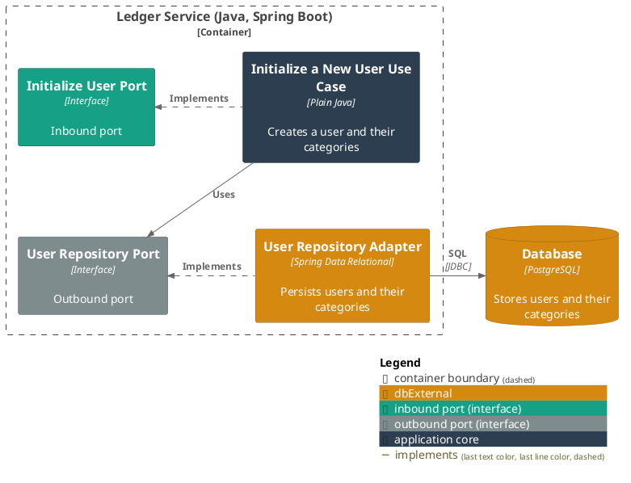
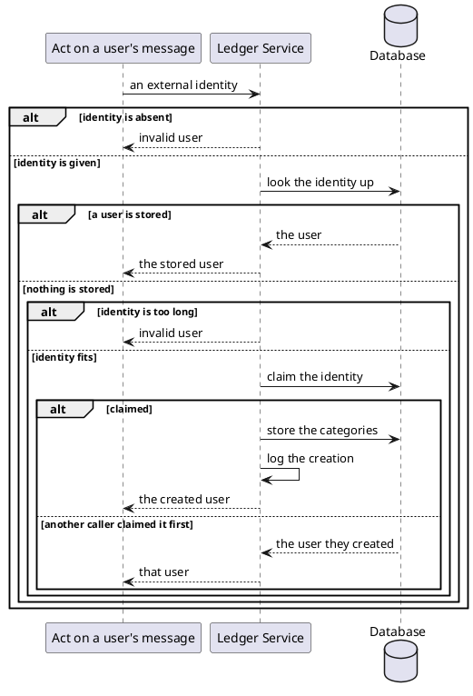

# Initialize a new user

- **In:** the external identity a person is known by
- **Out:** the user stored under that identity
- **Why:** a person can record spending from their first message, against a ready set of categories

*Implemented by `InitializeUserUseCase`.*

## Collaborators

| Direction | Collaborator                                          | Through                                                                           | For                                                       |
|-----------|-------------------------------------------------------|-----------------------------------------------------------------------------------|-----------------------------------------------------------|
| in        | [Act on a user's message](handle-incoming-message.md) | [Act on a user's message](handle-incoming-message.md)                             | resolving the person who sent a message, on every message |
| in        | [Web App](../../../web-app/README.md)                 | [The session API](../contracts/in/web-session-api.md)                             | resolving the person signing in, on every sign-in         |
| out       | [Database](../contracts/out/database.md)              | [Users, categories and expenses](../contracts/out/database.md)                    | storing the user and their catalogue                      |

## Outcomes

| Outcome                | When                                                                   | Result                                                                                                       |
|------------------------|--------------------------------------------------------------------------|----------------------------------------------------------------------------------------------------------------|
| User created           | nothing is stored under the identity                                   | the user and [the starting catalogue](../domain/grouping.md) are stored together, and the creation is logged |
| Existing user returned | a user is already stored under the identity                            | that user is returned and nothing is written                                                                 |
| Request rejected       | the request is absent or carries no identity                           | invalid user — nothing is looked up                                                                          |
| Identity too long      | the identity is longer than [its column](../contracts/out/database.md) | invalid user — nothing is stored                                                                             |
| Storage failed         | the store cannot be reached or refuses the write                       | the failure reaches the caller                                                                               |

## Components

## Flow

## References

- [ADR 0003: A category is unique per user and parent, not per user](../adr/0003-a-category-is-unique-per-user-and-parent-not-per-user.md) —
  why the starting catalogue can carry one name twice
- [ADR 0004: Column widths are checked in the persistence adapter](../adr/0004-column-widths-are-checked-in-the-persistence-adapter.md) —
  where an identity too long is refused
- [Read the current session](read-the-current-session.md) — how a browser is answered on every request after the
  first, once a row stands
