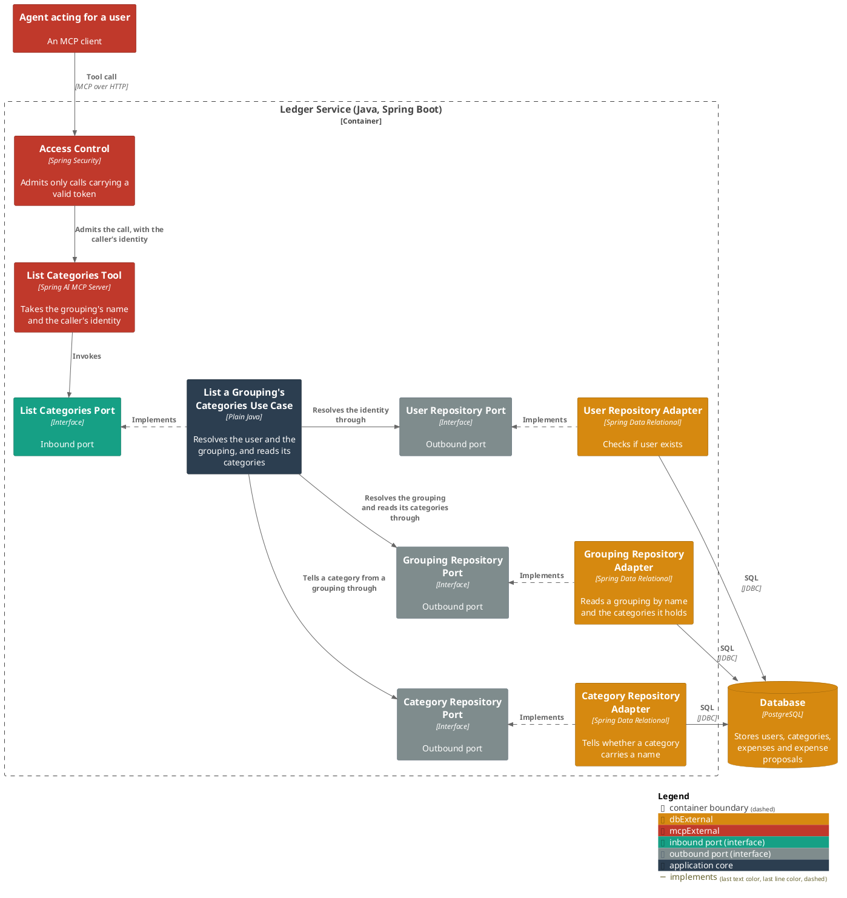
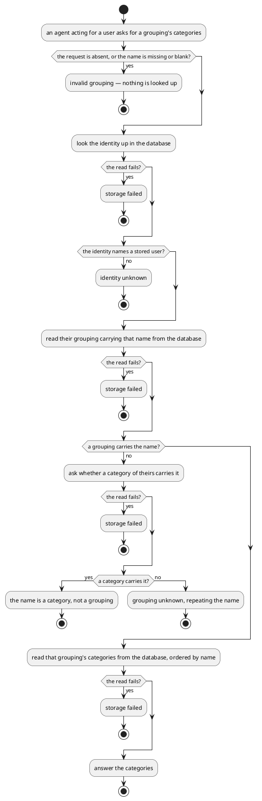

# List a grouping's categories

- **In:** the identity of the authenticated caller · a grouping, by name
- **Out:** the names of the categories filed under that grouping, ordered by name
- **Why:** spending is filed under a category, and this is how a caller holding only a grouping finds the
  categories it may choose between

*Implemented by `ListCategoriesUseCase`.*

## Collaborators

| Direction | Collaborator                                                                                                 | Through                                                                           | For                                                                                             |
|-----------|--------------------------------------------------------------------------------------------------------------|-----------------------------------------------------------------------------------|---------------------------------------------------------------------------------------------------|
| in        | [Record the spending a user's message names](../../../ai-connector-service/docs/usecases/extract-intents.md) | [MCP — the list categories tool](../contracts/in/mcp.md)                          | narrowing a grouping to the categories an expense may be filed under                            |
| out       | [Database](../contracts/out/database.md)                                                                     | [Users, categories, expenses and expense proposals](../contracts/out/database.md) | resolving the identity, resolving the grouping, reading its categories, telling a category from a grouping |

## Rules

- The identity is the one the service has already authenticated
  ([authenticated user id](../domain/authenticated-user-id.md)); the request never names whose categories it is
  ([ADR 0007](../adr/0007-an-mcp-caller-is-identified-by-a-signed-token-not-a-tool-argument.md)).
- Only the caller's own groupings and categories are reachable; no argument widens that.
- The [incoming message id](../domain/incoming-message-id.md) is not read, so a credential carrying none still lists.
- A [grouping](../domain/grouping.md) is named, never identified by a stored id.
- The name is present, and it is not blank.
- The name is resolved against the caller's groupings, and a grouping carrying it holds it alone.
- A name no grouping of theirs carries is rejected, and the message repeats the name.
- A name carried by a category of theirs rather than a grouping is rejected as a category, not a grouping.
- A name that is both a grouping and a category resolves to the grouping.
- Whether a category carries the name is asked only once no grouping does.
- A grouping holding no categories answers an empty list, which is not a failure.
- Nothing is stored, created or changed.

## Outcomes

| Outcome            | When                                                                     | Result                                                                 |
|--------------------|--------------------------------------------------------------------------|------------------------------------------------------------------------|
| Categories listed  | the identity names a stored user and the name resolves to their grouping | that grouping's categories, ordered by name                            |
| Request rejected   | the request is absent, or the name is missing or blank                   | invalid grouping — nothing is looked up                                |
| Identity unknown   | nothing is stored under the identity                                     | the request is rejected and nothing is listed                          |
| Grouping unknown   | neither a grouping nor a category of theirs carries that name            | the request is rejected, repeating the name that was asked for         |
| Name is a category | no grouping of theirs carries the name and a category of theirs does     | the request is rejected, saying the name is a category, not a grouping |
| Storage failed     | the store cannot be reached                                              | the failure reaches the caller                                         |

## Components

## Flow

