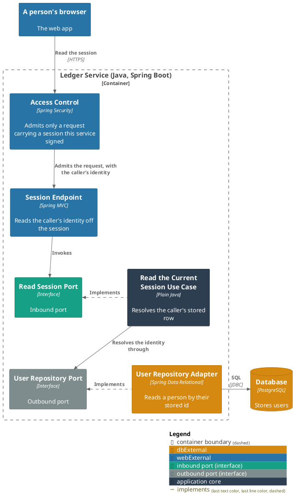
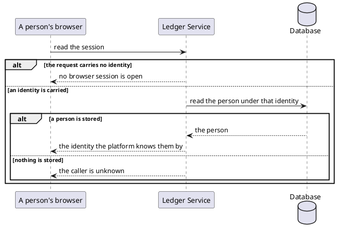

# Read the current session

- **In:** the identity of the authenticated caller
- **Out:** the stored person that identity names
- **Why:** a page that has just loaded can tell whether anyone is signed in, and who

*Implemented by `ReadSessionUseCase`.*

## Prerequisites

- The caller carries a browser session this service signed.
- A person is stored under the identity that session names.

## Collaborators

| Direction | Collaborator                             | Through                                                                           | For                                            |
|-----------|------------------------------------------|-----------------------------------------------------------------------------------|------------------------------------------------|
| in        | [Web App](../../../web-app/README.md)    | [The session API](../contracts/in/web-session-api.md)                             | deciding whether to show the shell or the sign-in |
| out       | [Database](../contracts/out/database.md) | [Users, categories and expenses](../contracts/out/database.md)                    | resolving the caller's own row                 |

## Outcomes

| Outcome          | When                                              | Result                                                     |
|------------------|---------------------------------------------------|------------------------------------------------------------|
| Session answered | the identity names a stored person                | that person, answered by the identity the platform knows them by |
| Caller unknown   | nothing is stored under the identity              | the request is rejected as an unknown caller               |
| Request rejected | the request carries no identity                   | no browser session is open — nothing is looked up          |
| Storage failed   | the store cannot be reached                       | the failure reaches the caller                             |

## Components

## Flow

## References

- [ADR 0013: A browser session is a cookie-borne token with its own audience](../adr/0013-a-browser-session-is-a-cookie-borne-token-with-its-own-audience.md) —
  what the caller is holding when it reaches here
- [Initialize a new user](initialize-a-new-user.md) — where the row this reads is created
