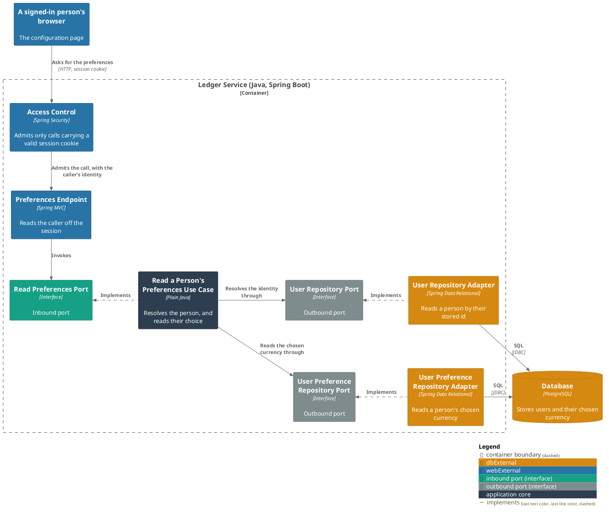
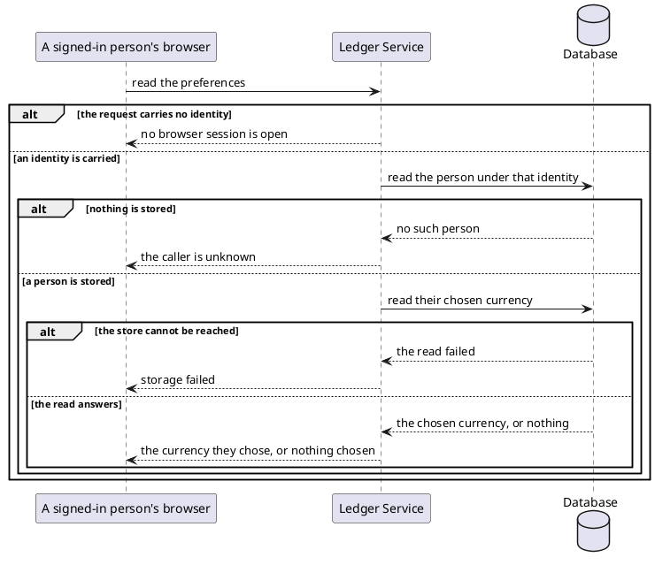

# Read a person's preferences

- **In**
  - the identity of the authenticated caller
- **Out**
  - the currency their amounts are assumed to be in, or nothing where they have chosen none
- **Why:** a configuration page can show what the bot is currently assuming, before anyone changes it

*Implemented by `ReadPreferencesUseCase`.*

## Prerequisites

- The caller is authenticated. The request never names whose preferences they are.
- A user is stored under that identity.

## Collaborators

| Direction | Collaborator                                                                      | Through                                                                 | For                                          |
|-----------|-----------------------------------------------------------------------------------|-------------------------------------------------------------------------|----------------------------------------------|
| in        | [Set a default currency](../../../web-app/docs/usecases/set-a-default-currency.md) | [Browsing the ledger from a browser](../contracts/in/web-browse-api.md) | standing the picker on the stored choice     |
| out       | [Database](../contracts/out/database.md)                                           | [Users, categories and expenses](../contracts/out/database.md)          | resolving the identity, and reading their stored choice |

## Outcomes

| Outcome              | When                                                                    | Result                                            |
|----------------------|-------------------------------------------------------------------------|---------------------------------------------------|
| Preferences answered | the identity names a stored person                                      | the currency they chose                           |
| Nothing chosen       | that person has never chosen one, or their stored choice cannot be read | no currency, and no failure                       |
| Identity unknown     | nothing is stored under the identity                                    | the request is rejected and nothing is read       |
| Request rejected     | the request carries no identity                                         | no browser session is open — nothing is looked up |
| Storage failed       | the store cannot be reached                                             | the failure reaches the caller                    |

## Components

## Flow

## References

- [ADR 0013: A browser session is a cookie-borne token with its own audience](../adr/0013-a-browser-session-is-a-cookie-borne-token-with-its-own-audience.md) —
  what the caller is holding when it reaches here
- [Replace a person's preferences](replace-the-preferences.md) — how the choice this answers is made
- [Act on a user's message](handle-incoming-message.md) — what the stored choice is used for
