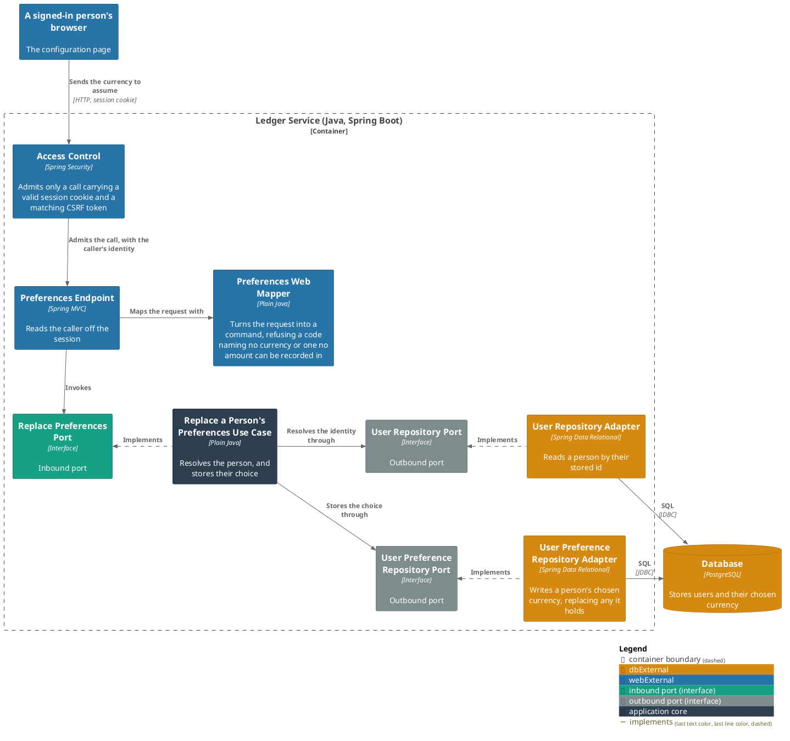
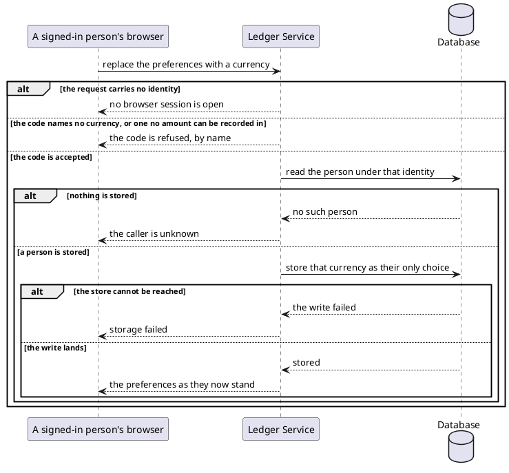

# Replace a person's preferences

- **In**
  - the identity of the authenticated caller
  - the currency their amounts are to be assumed in
- **Out**
  - their preferences as they now stand
- **Why:** the bot stops ignoring an amount a person states with no currency

*Implemented by `ReplacePreferencesUseCase`.*

## Prerequisites

- The caller is authenticated. The request never names whose preferences they are.
- A user is stored under that identity.

## Collaborators

| Direction | Collaborator                                                                       | Through                                                                 | For                                              |
|-----------|------------------------------------------------------------------------------------|-------------------------------------------------------------------------|--------------------------------------------------|
| in        | [Set a default currency](../../../web-app/docs/usecases/set-a-default-currency.md) | [Browsing the ledger from a browser](../contracts/in/web-browse-api.md) | saving the currency a person picked              |
| out       | [Database](../contracts/out/database.md)                                           | [Users, categories and expenses](../contracts/out/database.md)          | resolving the identity, and storing their choice |

## Outcomes

| Outcome              | When                                                                                          | Result                                                      |
|----------------------|-----------------------------------------------------------------------------------------------|-------------------------------------------------------------|
| Preferences replaced | the identity names a stored person                                                            | that currency is the only one stored for them, and answered |
| Currency refused     | the code names no currency, or one [no amount can be recorded in](../domain/currency-code.md) | the request is refused and nothing is stored                |
| Identity unknown     | nothing is stored under the identity                                                          | the request is rejected and nothing is stored               |
| Request rejected     | the request carries no identity                                                               | no browser session is open — nothing is stored            |
| Storage failed       | the store cannot be reached                                                                   | the failure reaches the caller                              |

Two replacements arriving together land one after the other; neither is refused.

## Components

## Flow

## References

- [ADR 0013: A browser session is a cookie-borne token with its own audience](../adr/0013-a-browser-session-is-a-cookie-borne-token-with-its-own-audience.md) —
  what the caller is holding when it reaches here
- [Read a person's preferences](read-the-preferences.md) — how the stored choice is read back
- [Act on a user's message](handle-incoming-message.md) — what the stored choice is used for
