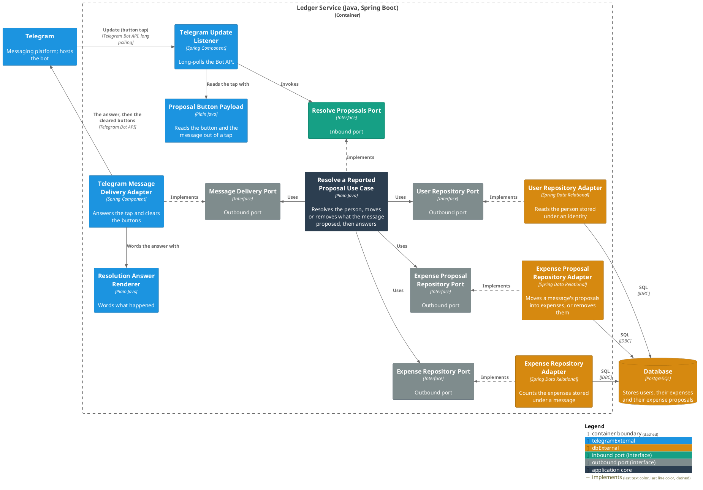
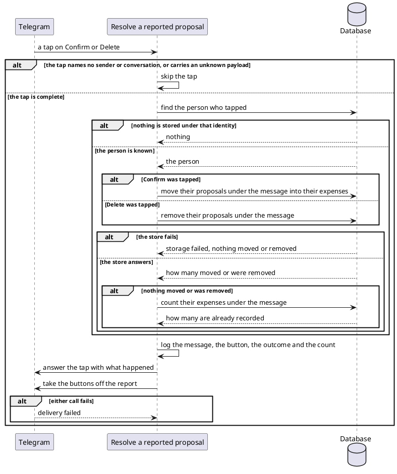

# Resolve a reported proposal

- **In:** who tapped · the conversation the report sits in · which message carries the report · which tap it is ·
  the [message](../domain/incoming-message-id.md) the buttons name · which of the two buttons was tapped
- **Out:** an answer to the tap, and a report whose buttons are gone
- **Why:** the spending a report lists stops being pending — it becomes the person's ledger, or it is thrown away

*Implemented by `ResolveProposalsUseCase`.*

## Collaborators

| Direction | Collaborator                                          | Through                                                                           | For                                                                             |
|-----------|-------------------------------------------------------|-----------------------------------------------------------------------------------|---------------------------------------------------------------------------------|
| in        | [Telegram](../contracts/in/telegram-updates.md)       | [Incoming messages](../contracts/in/telegram-updates.md)                          | delivering the tap on a report's button                                         |
| in        | [Act on a user's message](handle-incoming-message.md) | [Outgoing replies](../contracts/out/telegram-replies.md)                          | putting the buttons on the report, and storing the proposals a tap resolves     |
| out       | [Database](../contracts/out/database.md)              | [Users, categories, expenses and expense proposals](../contracts/out/database.md) | resolving who tapped, moving or removing what the message proposed, counting it |
| out       | [Telegram](../contracts/out/telegram-replies.md)      | [Outgoing replies](../contracts/out/telegram-replies.md)                          | answering the tap, and taking the buttons off the report                        |

## Outcomes

| Outcome            | When                                                                                 | Result                                                                                      |
|--------------------|--------------------------------------------------------------------------------------|---------------------------------------------------------------------------------------------|
| Confirmed          | the person's proposals under that message are still stored, and Confirm was tapped   | they become expenses carrying that message; the tap says how many, and the buttons come off |
| Discarded          | the person's proposals under that message are still stored, and Delete was tapped    | they are removed; the tap says how many, and the buttons come off                           |
| Already confirmed  | nothing was left to resolve, and expenses are stored under that message              | the tap says how many are already recorded, and the buttons come off                        |
| Nothing to resolve | nothing of that person's is stored under the message, or under their identity        | the tap is told there is nothing left, and the buttons come off                             |
| Tap skipped        | the tap names no sender or no conversation, or carries a payload this bot never sent | nothing happens and the tap is left unanswered                                              |
| Tap rejected       | the tap is absent                                                                    | rejected as invalid; nothing is looked up                                                   |
| Storage failed     | the move, the removal or the count fails                                             | nothing is moved or removed, the buttons stay, and the failure reaches the caller           |
| Answer failed      | the tap cannot be answered, or the buttons cannot be taken off                       | the resolution stands, and the failure reaches the caller                                   |

A failure of any kind is logged where the tap was delivered, and its batch is acknowledged with the rest.

## Components

## Flow

## References

- [ADR 0012: A set of rows moves between tables in one statement](../adr/0012-a-set-of-rows-moves-between-tables-in-one-statement.md) —
  why two taps at once resolve the report once
- [ADR 0006: An expense proposal is a table and an entity of its own](../adr/0006-an-expense-proposal-is-a-table-and-an-entity-of-its-own.md) —
  why confirming writes an expense instead of flipping a status
