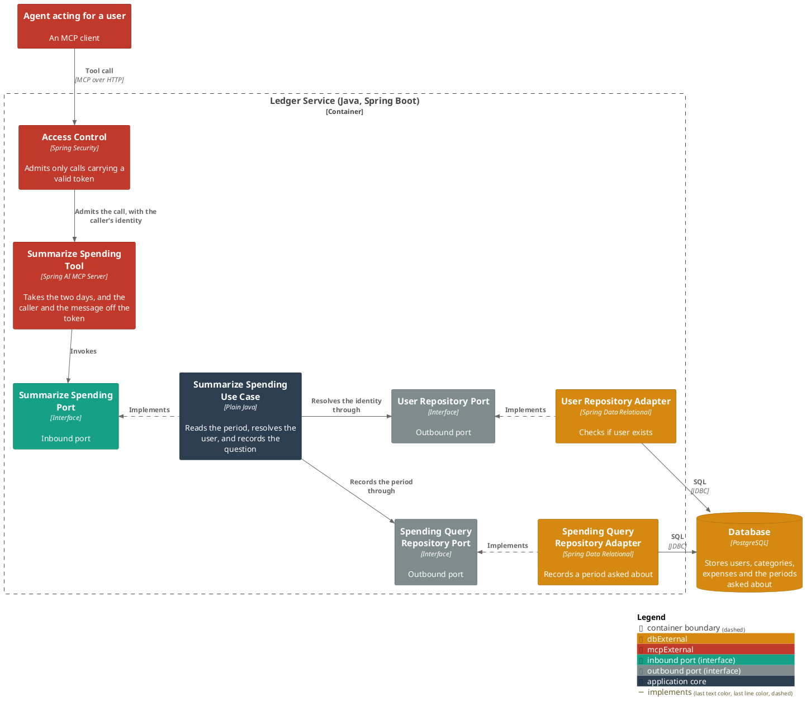
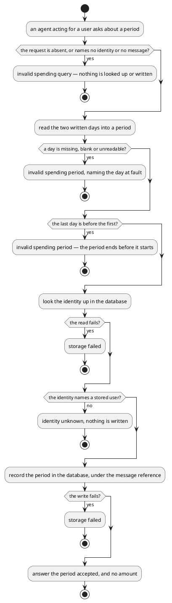

# Summarize spending over a period

- **In:** the identity of the authenticated caller · the reference of the message being handled · the first day
  of the period, as written · the last day, as written
- **Out:** the period that was accepted, and no amount
- **Why:** it is how a question about what someone spent becomes a period the turn answering their message can
  total

*Implemented by `SummarizeSpendingUseCase`.*

## Collaborators

| Direction | Collaborator                                                                                                 | Through                                                                           | For                                                                    |
|-----------|--------------------------------------------------------------------------------------------------------------|-----------------------------------------------------------------------------------|--------------------------------------------------------------------------|
| in        | [Record the spending a user's message names](../../../ai-connector-service/docs/usecases/extract-intents.md) | [MCP — the summarize spending tool](../contracts/in/mcp.md)                       | asking about the period it read out of its caller's message            |
| out       | [Database](../contracts/out/database.md)                                                                     | [Users, categories, expenses and expense proposals](../contracts/out/database.md) | resolving the identity, and recording the period against the message   |

## Rules

- The identity is the one the service has already authenticated
  ([authenticated user id](../domain/authenticated-user-id.md)); the request never names whose spending it is
  ([ADR 0007](../adr/0007-an-mcp-caller-is-identified-by-a-signed-token-not-a-tool-argument.md)).
- The [message reference](../domain/message-reference.md) is read from the same credential as the identity, and
  the request never names it either
  ([ADR 0010](../adr/0010-a-message-reference-rides-the-caller-token-not-the-extraction-request.md)).
- The two written days are read into a [spending period](../domain/spending-period.md) before anything is looked
  up, so a period that does not hold together reaches no store.
- The identity is resolved only once a period holds, and the period is recorded only once the identity does.
- A recorded [spending query](../domain/spending-query.md) is tied to the message being handled, so the turn that
  minted the reference is the one that reports it.
- Nothing is read out of the ledger here, and no total is computed: the amounts are put in front of the user by
  [the turn](handle-incoming-message.md), and reach the caller nowhere.
- The answer is the period that was accepted, as two days.
- A repeat of the same request records a second query; the turn reports each distinct period once.

## Outcomes

| Outcome          | When                                                                             | Result                                                             |
|------------------|------------------------------------------------------------------------------------|----------------------------------------------------------------------|
| Period recorded  | the identity names a stored user and the two days make a period                  | the period is stored under the message reference, and answered back |
| Request rejected | the request is absent, or names no identity or no message                        | invalid spending query — nothing is looked up or written           |
| Period rejected  | a day is missing, blank or unreadable, or the last day is before the first       | invalid spending period — nothing is looked up or written          |
| Identity unknown | nothing is stored under the identity                                             | the request is rejected and nothing is written                     |
| Storage failed   | the store cannot be reached                                                      | the failure reaches the caller                                     |

## Components

## Flow

