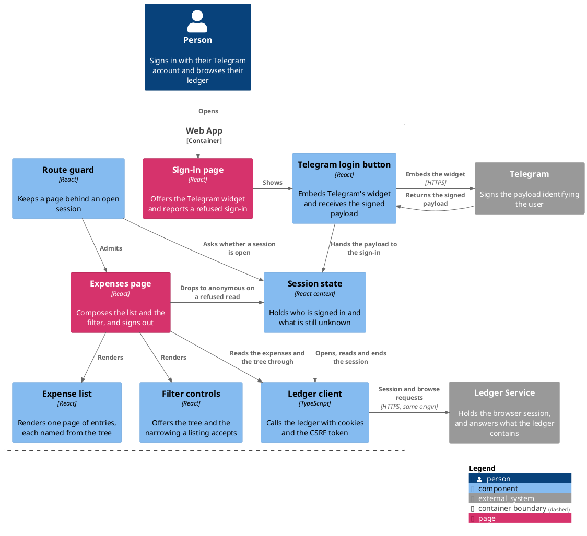

# Web App

The browser client. A person signs in with the Telegram account they use for the bot, and lands on a list of
everything the ledger holds for them.

The identity is a Telegram user id. Someone who has only ever talked to the
bot and someone who has only ever used this page are the same user.

- [Conventions](docs/conventions.md) — how this module is structured, tested, styled and built.
- [Configuration](docs/configuration.md) — every setting and its default.
- [Sign in with Telegram](docs/usecases/sign-in-with-telegram.md) — what the sign-in does.
- [Browse recorded expenses](docs/usecases/browse-recorded-expenses.md) — what the list behind it does.
- [Ledger session API](docs/contracts/out/ledger-session-api.md) — what it sends the ledger to hold a session.
- [Ledger browse API](docs/contracts/out/ledger-browse-api.md) — what it sends the ledger to fill the list.

## Components



## Running It

```
npm ci
npm run dev
```

The dev server proxies `/api` to a ledger on port 1000, so the page and the API share one origin.

## Signing In for Real

The Telegram widget will not render on `localhost` — Telegram refuses to register that domain for a bot. Signing
in therefore needs a public hostname in front of the dev server:

```
ngrok http 1004
```

Then, once per tunnel address:

| Step | What                                                                                |
|------|-------------------------------------------------------------------------------------|
| 1    | Give the tunnel's hostname to BotFather with `/setdomain`                           |
| 2    | Start the ledger with `WEB_SESSION_COOKIE_SECURE=true` — the browser now sees HTTPS |
| 3    | Open the tunnel's address, not `localhost`                                          |

`server.allowedHosts` in `vite.config.ts` already covers ngrok's own domains. A tunnel on a custom domain, or a
different provider, is a new entry in that list — Vite refuses a `Host` header it was not told about.

A free tunnel address changes on every restart, so steps 1 and 3 repeat each time. A reserved domain pins it.

Only the sign-in needs this. Everything else runs on `localhost`, and the tests never call Telegram at all —
they build a payload and sign it with a test bot token.
