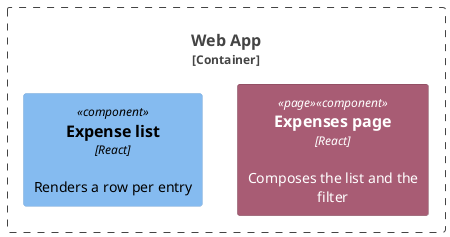

# [Conventions](../conventions.md) > Writing Documentation

How every rule is written is repository-wide:
[Writing Documentation](../../../docs/conventions/documentation.md). Below is what a browser module changes.

**A short page beats a complete one.** A page nobody finishes documents nothing, and the code is always there for
whatever the page left out. When a section is a judgement call, cut it.

## A Use-Case Page

- **Name the route, do not describe the screen.** The page carries the URL it lives at. What a person sees —
  which columns a table has, what a control is labelled, where the empty state reads — is on the screen, and it is
  pinned by the component's own test. A **What the Page Shows** section is the shape this mistake takes.
- **Rules carry only what the screen cannot show.** Which reads happen and when, what is deliberately never sent,
  which side decides what. A rule a reader can check by opening the page is not a rule.
- **The diagram outranks the prose.** Where a component diagram already shows that the page composes the list and
  the filter, no sentence says it again.

## Collaborators

- **A capability every page depends on lists no consumers.** Session state is reached by each page behind the
  guard; a row per page grows into a copy of the use-case index and is stale the day a page is added. One row
  naming the set — *every page behind the route guard* — says the same thing forever.
- The consumers still link **out** to it. Reciprocity is one-directional here on purpose: the specific page names
  what it depends on, the shared capability does not enumerate who depends on it.

## An Out-Contract Page

**How the call fails is a table**, one row per failure, saying what reaches the person. Wording, transport
failures, an empty body and a refused session are conditions with outcomes, which is what a table holds. The
repository-wide rule already prefers a table to a paragraph; a bullet list is the same paragraph with dashes.

## Diagram Colour

The route components — everything in `pages/` — carry a tag of their own, so a reader sees at a glance where a
route enters. Declare it in the preamble and tag each page:

In a plan's diagram the `new` tag from
[Marking What a Change Adds](../../../docs/conventions/diagrams.md#marking-what-a-change-adds) wins: what the
change creates is the question that diagram is read to answer, and a page is still a page without the colour.
