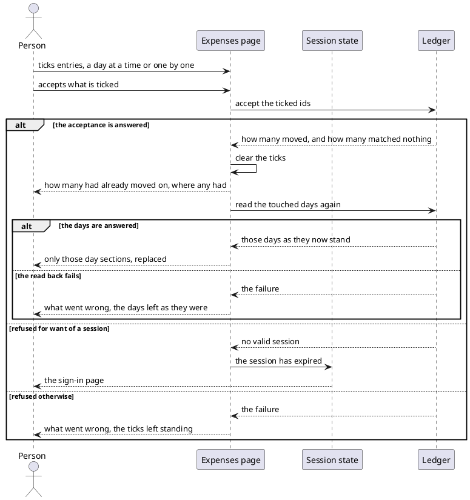
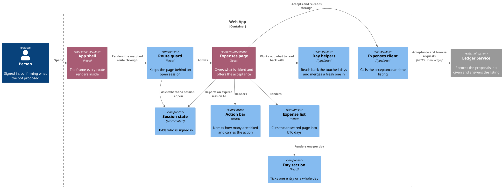

# Accept pending expenses

- **At:** `/`, behind the route guard
- **In:** a signed-in person
- **In:** the entries awaiting a decision that they tick on the listing
- **Out:** those entries recorded in the ledger
- **Out:** the days they sat on, shown again as they now stand
- **Why:** everything the bot proposed is confirmed in one action, without answering it entry by entry

*Implemented by the expenses page, the expense list with its day sections, the action bar and the expenses
client.*

## Collaborators

| Direction | Collaborator                                                                                | Through                                                 | For                                      |
|-----------|---------------------------------------------------------------------------------------------|---------------------------------------------------------|------------------------------------------|
| in        | [A signed-in person's browser](sign-in-with-telegram.md)                                    | the expenses page                                       | confirming what the bot proposed         |
| out       | [Accept chosen proposals](../../../ledger-service/docs/usecases/accept-chosen-proposals.md) | [the browse API](../contracts/out/ledger-browse-api.md) | moving the ticked entries to recorded    |
| out       | [Browse expenses](../../../ledger-service/docs/usecases/browse-expenses.md)                 | [the browse API](../contracts/out/ledger-browse-api.md) | reading the touched days back            |
| out       | [Sign in with Telegram](sign-in-with-telegram.md)                                           | [the session state it owns](sign-in-with-telegram.md)   | dropping to anonymous on a refused write |

The listing this acts on is [Browse recorded expenses](browse-recorded-expenses.md).

## Prerequisites

- A session is open.
- A listing is on screen, since every id a tick carries is read from it.

## Outcomes

| Outcome                | When                                              | Result                                                                         |
|------------------------|---------------------------------------------------|--------------------------------------------------------------------------------|
| Nothing is offered     | nothing is ticked                                 | the action bar's row stands with no action in it                               |
| Accepted               | the acceptance is answered                        | the ticks clear, and the touched days are read again and replaced in place     |
| Some had moved on      | the answer names ids that matched nothing         | the person is told in words how many, and the touched days are still read back |
| Nothing more is ticked | the bound on one request is reached               | every unticked tick is disabled, and the ticked ones stay live                 |
| Nothing is sent        | the action is pressed again while the call is out | nothing, and one call stands                                                   |
| Failure reported       | the acceptance is refused for any other reason    | the wording is shown, the ticks stand, and the listing on screen is unchanged  |
| Sent to sign in        | the acceptance is refused for want of a session   | the sign-in page is shown, and nothing is read back                            |
| The days stand         | the read back fails                               | the failure is shown, and the days on screen stay as the acceptance found them |

## Flow

## Components

## References

- [ADR 0014: The web app and the ledger are served from one origin](../../../docs/adr/0014-the-web-app-and-the-ledger-are-served-from-one-origin.md) —
  why the acceptance carries a CSRF token read from a cookie
- [Clear the emptied reports](../../../ledger-service/docs/usecases/clear-emptied-reports.md) — what happens in
  Telegram to a report this acceptance emptied
