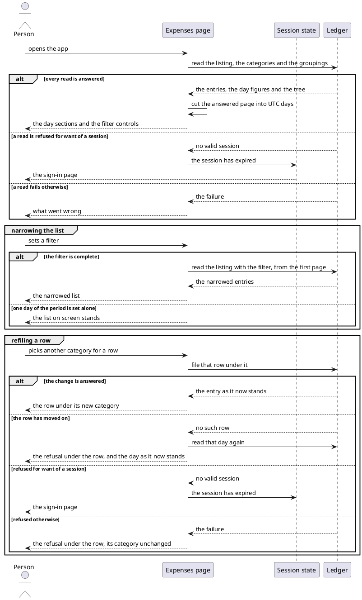
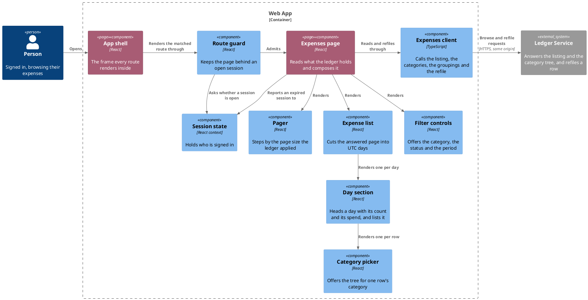

# Browse recorded expenses

- **At:** `/`, behind the route guard
- **In:** a signed-in person
- **In:** a filter they set (optional)
- **In:** another category they pick for a row (optional)
- **Out:** a page of their expenses, newest first, cut into UTC days, and the category tree the filter offers
- **Out:** a row filed under the category picked for it
- **Why:** everything the bot recorded, and everything still awaiting a decision, is visible in one place
- **Why:** a miscategorised entry is put right where it is read, without leaving the listing

*Implemented by the expenses page, the filter controls, the expense list with its day sections, the category
picker, the pager and the expenses client.*

What this listing shows awaiting a decision is acted on by
[Accept pending expenses](accept-pending-expenses.md).

## Collaborators

| Direction | Collaborator                                             | Through                                                 | For                                                                                 |
|-----------|----------------------------------------------------------|---------------------------------------------------------|-------------------------------------------------------------------------------------|
| in        | [A signed-in person's browser](sign-in-with-telegram.md) | the expenses page                                       | seeing what the ledger holds for them                                               |
| out       | [Ledger Service](../contracts/out/ledger-browse-api.md)  | [the browse API](../contracts/out/ledger-browse-api.md) | the entries, each day's figures, and the categories and groupings behind the filter |
| out       | [Ledger Service](../contracts/out/ledger-browse-api.md)  | [the browse API](../contracts/out/ledger-browse-api.md) | filing a row under the category picked for it                                       |
| out       | [Sign in with Telegram](sign-in-with-telegram.md)        | [the session state it owns](sign-in-with-telegram.md)   | dropping to anonymous on a refused call                                             |

## Outcomes

| Outcome                | When                                                                  | Result                                                                             |
|------------------------|-----------------------------------------------------------------------|------------------------------------------------------------------------------------|
| The list is shown      | every read is answered                                                | the entries appear newest first in day sections, and the controls offer the tree   |
| Nothing to show        | the listing answers no entries                                        | the page says so in place of the list                                              |
| Part of the list       | the total is larger than the entries answered                         | the page names which of them are on screen, and offers the way on                  |
| Another page           | the way on or back is used                                            | the listing is read again at the new offset                                        |
| The list narrows       | a filter is changed, the period complete or empty                     | the listing is read again with it, from the first page                             |
| Nothing is read        | one day of the period is set or cleared on its own                    | nothing is sent, and the list on screen stands                                     |
| Refiled                | a row's category is changed and the change is answered                | that row stands under its new category                                             |
| Refiled under a filter | the same, with the listing narrowed by category                       | the day it sits on is read again, and the row leaves a filter it no longer matches |
| No change is sent      | a change is out, or the category picked is the one the row has        | nothing, and one change stands                                                     |
| Refile refused         | a change is refused for any reason but a session or the row moving on | the refusal is shown under that row, and its category stands                       |
| The row moved on       | the ledger answers that the row no longer matches                     | the refusal is shown under that row, and the day it sat on is read again           |
| Sent to sign in        | a read or a change is refused for want of a session                   | the sign-in page is shown, with no reload                                          |
| Failure reported       | a read fails for any other reason                                     | the failure is shown, and whatever is on screen stays                              |
| Categories unnamed     | only the category read failed                                         | the entries still list, each with its category blank                               |

## Flow

## Components

## References

- [ADR 0014: The web app and the ledger are served from one origin](../../../docs/adr/0014-the-web-app-and-the-ledger-are-served-from-one-origin.md) —
  why every read carries the session cookie without a CORS step
- [Accept pending expenses](accept-pending-expenses.md) — what a person does with the entries this listing shows
  awaiting a decision
