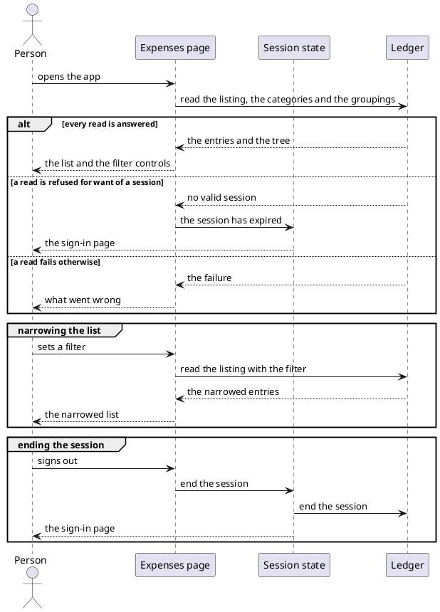
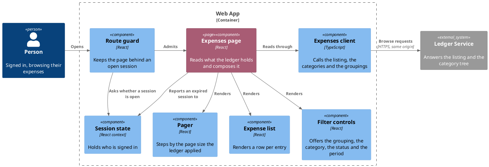

# Browse recorded expenses

- **At:** `/`, behind the route guard
- **In:** a signed-in person · a filter they set (optional)
- **Out:** a page of their expenses, newest first, and the category tree the filter offers
- **Why:** everything the bot recorded, and everything still awaiting a decision, is visible in one place

*Implemented by the expenses page, the expense list, the filter controls, the pager and the expenses client.*

## Collaborators

| Direction | Collaborator                                             | Through                                                 | For                                                             |
|-----------|----------------------------------------------------------|---------------------------------------------------------|-----------------------------------------------------------------|
| in        | [A signed-in person's browser](sign-in-with-telegram.md) | the expenses page                                       | seeing what the ledger holds for them                           |
| out       | [Ledger Service](../contracts/out/ledger-browse-api.md)  | [the browse API](../contracts/out/ledger-browse-api.md) | the entries, and the categories and groupings behind the filter |
| out       | [Sign in with Telegram](sign-in-with-telegram.md)        | [the session state it owns](sign-in-with-telegram.md)   | dropping to anonymous on a refused read, and ending the session |

## Rules

- Opening the page reads the listing, the categories and the groupings. Changing a filter reads the listing
  again; the tree is read once.
- A filter field left unset is not sent, so the ledger applies its own default for it.
- The period narrows by when a row was recorded, not when the money was spent.
- A row is named from the category list, matched by id. A category the list does not answer leaves it blank.
- A grouping narrows the categories offered, from the tree already held. It is not a listing filter and never
  reaches the ledger; a category outside the chosen one is dropped.
- The listing is read with the ledger's own page size. Paging steps by the size it answered with.
- Changing a filter returns to the first page.
- Only the newest listing read reaches the screen. A slower one answering after its filter was left is dropped,
  and so is its refusal.
- A refusal for want of a session drops the session to anonymous, from any of the three reads. That is distinct
  from signing out, which ends a session still open and tells the ledger so. An expiry tells it nothing.

## Outcomes

| Outcome            | When                                                    | Result                                                            |
|--------------------|---------------------------------------------------------|-------------------------------------------------------------------|
| The list is shown  | every read is answered                                  | the entries appear newest first, and the controls offer the tree  |
| Nothing to show    | the listing answers no entries                          | the page says so in place of the list                             |
| Part of the list   | the total is larger than the entries answered           | the page names which of them are on screen, and offers the way on |
| Another page       | the way on or back is used                              | the listing is read again at the new offset                       |
| The list narrows   | a filter is changed                                     | the listing is read again with it, from the first page            |
| Sent to sign in    | any of the three reads is refused for want of a session | the sign-in page is shown, with no reload                         |
| Failure reported   | a read fails for any other reason                       | the failure is shown, and whatever is on screen stays             |
| Categories unnamed | only the category read failed                           | the entries still list, each with its category blank              |
| Signed out         | the sign-out control is used                            | the sign-in page is shown, and the ledger clears the cookie       |

## Flow

## Components

