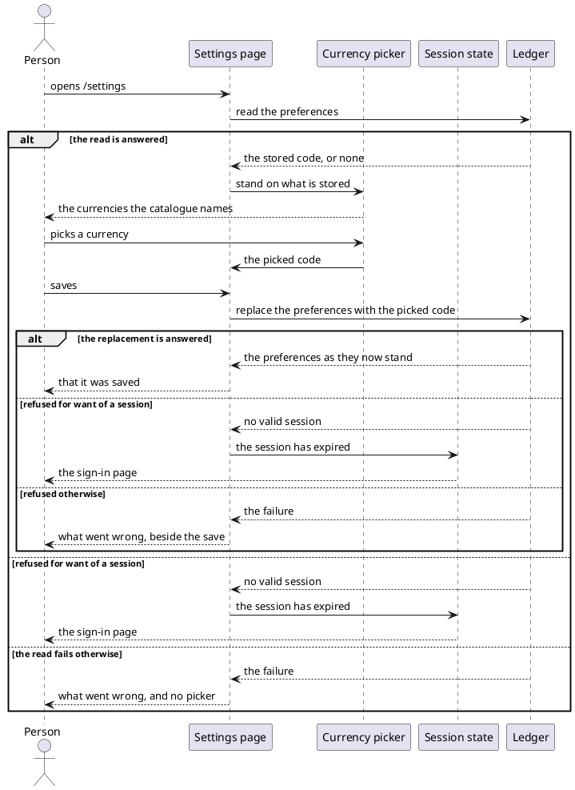
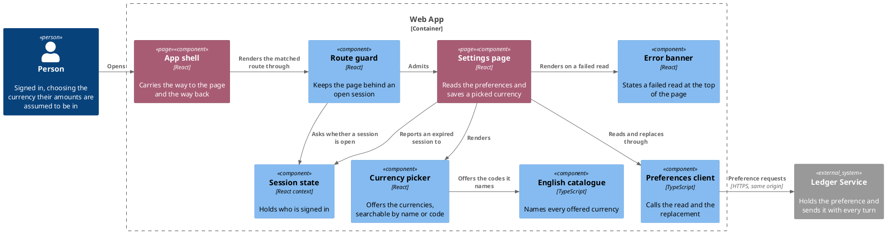

# Set a default currency

- **At:** `/settings`, behind the route guard
- **In:** a signed-in person
- **In:** the currency they pick from the offered list
- **Out:** that currency, stored as the one their amounts are assumed to be in
- **Why:** an amount the bot is sent with no currency is acted on rather than ignored

*Implemented by the settings page, the currency picker and the preferences client.*

## Collaborators

| Direction | Collaborator                                                                                | Through                                                 | For                                     |
|-----------|---------------------------------------------------------------------------------------------|---------------------------------------------------------|-----------------------------------------|
| in        | [A signed-in person's browser](sign-in-with-telegram.md)                                    | the settings page                                       | choosing the currency their bot assumes |
| out       | [Read the preferences](../../../ledger-service/docs/usecases/read-the-preferences.md)       | [the browse API](../contracts/out/ledger-browse-api.md) | the currency stored for them today      |
| out       | [Replace the preferences](../../../ledger-service/docs/usecases/replace-the-preferences.md) | [the browse API](../contracts/out/ledger-browse-api.md) | storing the currency they picked        |
| out       | [Sign in with Telegram](sign-in-with-telegram.md)                                           | [the session state it owns](sign-in-with-telegram.md)   | dropping to anonymous on a refused call |

## Prerequisites

- A session is open.

## Outcomes

| Outcome                    | When                                                    | Result                                                                     |
|----------------------------|---------------------------------------------------------|----------------------------------------------------------------------------|
| The stored choice is shown | the read answers a currency                             | the picker stands on it, and nothing is offered to save                    |
| Nothing chosen yet         | the read answers no currency                            | the picker stands unset, and nothing is offered to save                    |
| Ready to save              | the picked currency differs from the stored one         | the save is offered                                                        |
| Saved                      | the replacement is answered                             | the page reports it was saved, and the picker stands on the saved currency |
| Nothing is sent            | the save is used again while one is out                 | nothing, and one call stands                                               |
| The report clears          | another currency is picked                              | the save is offered again for the new choice                               |
| Save refused               | the replacement is refused for any reason but a session | the wording is shown beside the save, and the picked currency stands       |
| Nothing to configure       | the read fails for any reason but a session             | the failure is shown in place of the picker                                |
| Sent to sign in            | either call is refused for want of a session            | the sign-in page is shown, and no failure is left behind                   |

## Flow

## Components

## References

- [ADR 0014: The web app and the ledger are served from one origin](../../../docs/adr/0014-the-web-app-and-the-ledger-are-served-from-one-origin.md) —
  why the read and the write carry the session cookie with no CORS step
- [Browse recorded expenses](browse-recorded-expenses.md) — where a person lands after signing in again
