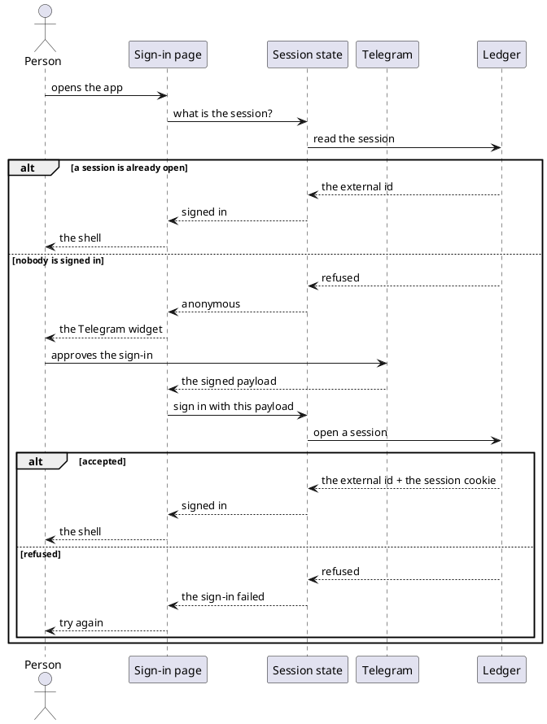

# Sign in with Telegram

- **In:** a person, and the Telegram account they use for the bot
- **Out:** a browser session held for that person
- **Why:** the ledger's data belongs to a Telegram user, so a browser has to prove it is one

*Implemented by the sign-in page, the login button and the session state.*

## Collaborators

| Direction | Collaborator                                             | Through                                                   | For                                          |
|-----------|----------------------------------------------------------|-----------------------------------------------------------|----------------------------------------------|
| in        | A person's browser                                       | the sign-in page                                          | starting and ending a session                |
| out       | [Telegram](https://core.telegram.org/widgets/login)      | the Login Widget script the page embeds                   | proving which Telegram account is signing in |
| out       | [Ledger Service](../contracts/out/ledger-session-api.md) | [The session API](../contracts/out/ledger-session-api.md) | opening, reading and ending the session      |

## Rules

- The page asks the ledger who is signed in **before** it decides what to show, and shows neither the sign-in
  nor the shell while that answer is outstanding.
- A refused read means nobody is signed in. It is not an error.
- The widget's payload is forwarded unchanged. Nothing here inspects it, and nothing here decides whether it is
  genuine — that is the ledger's, and only the ledger holds the bot token.
- The session cookie is never read by the page. It cannot be, and no code tries.
- The widget names one bot, fixed when the module is built. A person signing in with a Telegram account that has
  never used the bot is still signed in — the ledger stores them on the spot.

## Outcomes

| Outcome           | When                                      | Result                                                      |
|-------------------|-------------------------------------------|-------------------------------------------------------------|
| Already signed in | the session read on load succeeds         | the shell is shown, with no sign-in step                    |
| Signed in         | the widget's payload is accepted          | the shell is shown, and the session is held for the tab     |
| Sign-in refused   | the payload is rejected or the call fails | the sign-in page says so and offers the widget again        |
| Not signed in     | the session read is refused               | the sign-in page is shown                                   |
| Signed out        | the sign-out control is used              | the sign-in page is shown, and the ledger clears the cookie |

## Flow

