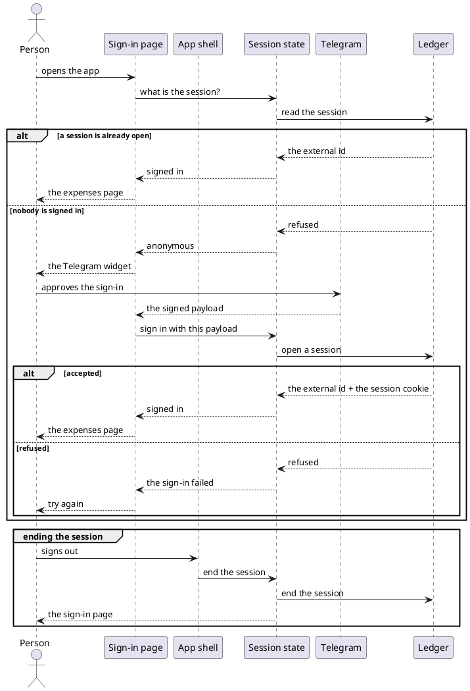

# Sign in with Telegram

- **At:** `/login`, and the session state every other route reads
- **In:** a person, and the Telegram account they use for the bot
- **Out:** a browser session held for that person
- **Why:** the ledger's data belongs to a Telegram user, so a browser has to prove it is one

*Implemented by the sign-in page, the login button and the session state.*

## Collaborators

| Direction | Collaborator                                             | Through                                                   | For                                            |
|-----------|----------------------------------------------------------|-----------------------------------------------------------|--------------------------------------------------|
| in        | A person's browser                                       | the sign-in page                                          | starting a session                             |
| in        | The app shell, on every route                            | the session state                                         | showing sign-out while signed in, and ending it |
| in        | Every page behind the route guard                        | the session state                                         | dropping an expired session                    |
| out       | [Telegram](https://core.telegram.org/widgets/login)      | the Login Widget script the page embeds                   | proving which Telegram account is signing in   |
| out       | [Ledger Service](../contracts/out/ledger-session-api.md) | [The session API](../contracts/out/ledger-session-api.md) | opening, reading and ending the session        |

## Outcomes

| Outcome           | When                                       | Result                                                          |
|-------------------|--------------------------------------------|-----------------------------------------------------------------|
| Already signed in | the session read on load succeeds          | the expenses page is shown, with no sign-in step                |
| Signed in         | the widget's payload is accepted           | the expenses page is shown, and the session is held for the tab |
| Sign-in refused   | the payload is rejected or the call fails  | the sign-in page says so and offers the widget again            |
| Not signed in     | the session read is refused                | the sign-in page is shown                                       |
| Signed out        | the sign-out control in the header is used | the sign-in page is shown, and the ledger clears the cookie     |

## Flow

## References

- [ADR 0013: A browser session is a cookie-borne token with its own audience](../../../ledger-service/docs/adr/0013-a-browser-session-is-a-cookie-borne-token-with-its-own-audience.md) —
  why the page never reads the session itself
- [ADR 0014: The web app and the ledger are served from one origin](../../../docs/adr/0014-the-web-app-and-the-ledger-are-served-from-one-origin.md) —
  why the cookie reaches the API with no CORS step
- [Browse recorded expenses](browse-recorded-expenses.md) — where a signed-in person lands
